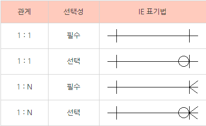
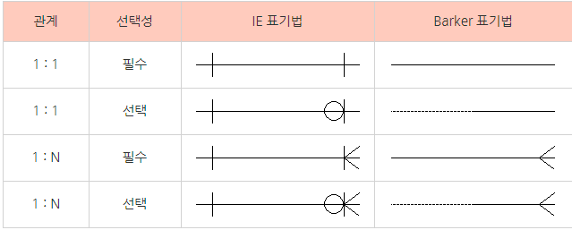
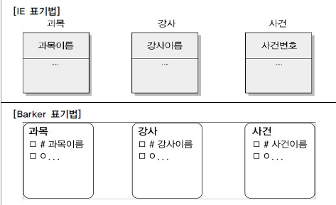
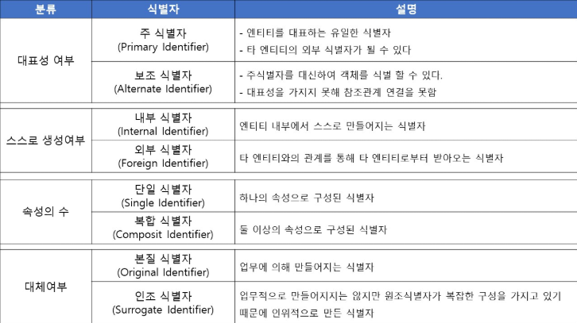

<!-- AUTO-GENERATED FROM NOTION. EDIT THE NOTION PAGE, NOT THIS FILE. -->

# SQL 기본

## 데이터 모델의 이해

<details>
<summary>목차</summary>


</details>

---

1. 모델링의 정의
  사람이 살아가면서 접할 수 있는 다양한 현상을 표기법에 따라 표기하는 것 자체

  → 약속(그림, 기호, 수식 등) 에 따라 다양하고 복잡한 여러 현상을 알기 쉽게 표현한 집합체

1. 모델링의 종류
  <details>
  <summary>정보시스템 모델링</summary>

  정보시스템을 구축하는 과정에서 업무 내용과 시스템의 구조를 적절한 표기법으로 표현하는 것

  정보 모델링, 데이터 모델링, 프로세스 모델링 등이 포함.

  <details>
  <summary>정보시스템 모델링의 3가지 관점</summary>

  **데이터 관점** : 업무가 어떤 데이터와 관련이 있는지, 관계는 어떠한지를 모델링하는 방법

  **프로세스 관점** : 업무가 실제로 처리하는 일이 무엇인지, 무엇을 해야 하는지 모델링하는 방법

  **데이터와 프로세스의 상관 관점** : 업무 처리 방식에 따라 데이터가 서로 어떤 영향을 주고 받는지를 모델링 하는 방법

  </details>

  </details>

  <details>
  <summary>수리 모델링</summary>

  = 수학적 모델링 / 미분, 상태, 시스템 방정식, 시스템 함수 등이 해당

  </details>

  <details>
  <summary>통계 모델링</summary>

  확률 현상을 차트, 표, 수식, 함수 등으로 표현, 데이터 분석에서 유용하게 사용.

  </details>

  <details>
  <summary>회로 모델링</summary>

  회로 소자를 이용해 증폭, 필터링, 스위칭 등 연산을 수행하는 회로를 특정한 규칙에 따라 표현

  </details>

1. 모델링의 특징
  1. 추상화 : 현실 세계를 일정한 형식에 맞춰 추상적으로 표현

  1. 단순화 : 복잡한 현실 세계를 특정한 약속에 따라 기호, 문자, 그림 등으로 쉽게 이해할 수 있게 단순화 하는 개념

  1. 명확화 : 애매함을 제거 / 이해하기 쉽도록 명확하게 현상을 기술 하는 것

## 데이터 모델링

데이터 모델링의 정의

데이터 관점에서 업무를 분석하고, 현실의 데이터를 약속된 표기법으로 표현하는 것

실무적으로는 데이터베이스를 구축하기 위한 분석 및 설계 과정을 의미

**데이터 모델이 제공하는 기능**

<details>
<summary>시스템 가시화 지원</summary>

시스템을 현재 또는 원하는 모습으로 가시화 → 개발자와 이해 관계자가 시스템 구조를 이해할 수 있도록 도움

</details>

<details>
<summary>시스템 구조와 행동 명세화</summary>

시스템 구조와 행동을 명세화해 구체적인 지침을 제공

</details>

<details>
<summary>구조화된 틀 제공</summary>

시스템을 구축하는 데 필요한 구조화된 틀을 제공 → 개발자가 효율적으로 시스템을 설계하고 구현할 수 있도록 함

</details>

<details>
<summary>문서화</summary>

구축 과정에서 결정한 사항을 문서화해 프로젝트 참여자 간 의사소통을 용이하게 하고, 프로젝트의 지식 기반을 구축

</details>

<details>
<summary>다양한 관점 제공</summary>

복잡한 시스템을 다룰 때 특정 부분에 초점을 맞추고, 다른 부분은 추상화해 처리할 수 있도록 도움

</details>

<details>
<summary>상세 수준의 구체화</summary>

구체화된 상세 주준의 표현 방법을 제공 → 시스템의 특정 부분을 더 세밀하게 다룰 수 있도록 함

</details>

<details>
<summary>**데이터 모델링의 중요성 및 유의점**</summary>

- 데이터 모델링의 중요성
  파급효과 : 시스템 구축에서 데이터 설계는 다른 어떤 설계 과정보다 중요한 영향을 미침

  복잡한 정보 요구 사항을 간결하게 표현 : 시스템의 정보 요구 사항과 한계를 가장 명확하고
  간결하게 표현할 수 있는 도구

  데이터 품질 향상 : 데이터의 중복, 비유연성, 비일관성을 줄여 데이터의 품질을 높임

- 데이터 모델링 시 유의점
  중복 최소화 : 데이터베이스가 여러 위치에 같은 정보를 저장하지 않게 함.
  다만 필요에 따라 중복이 있을 수 있으나 이를 최소화 하는 것이 중요.

  비유연성 낮춤 : 데이터 정의를 데이터 사용 프로세스와 분리하여 비유연성을 줄이고
  유연성을 높임

  ---

  **비일관성 : 같은 데이터가 여러 곳에 저장되어 있어서, 하나를 수정했을 때 다른 곳은 수정되지 않아 정보가 서로 맞지 않는 현상**

  **비유연성 : 서비스에 작은 변화가 생겼을 때 데이터베이스 구조 전체나 애플리케이션 코드를 대대적으로 뜯어고쳐야 하는 현상**

</details>

데이터 모델링의 3단계

1. 개념적 데이터 모델링 (추상적)
  추상화 수준이 높고 업무 중심적이며 포괄적인 수준의 모델링 진행

  서비스를 구축하기 전에 필요한 데이터가 무엇인지 파악하는 것
  주요 작업 : ERD (E-R 다이어그램) 작성

1. 논리적 데이터 모델링 (추상적)
  시스템 구축을 위한 키, 속성, 관계 등을 정확하게 표현하며, 높은 재사용성을 가짐

  각각의 데이터들이 어떤 속성을 가지고 서로 어떤 관계를 맺는지 테이블 구조로 뼈대를 잡음

  (개념적, 논리적 모델링이 끝나면 개념 스키마가 완성)

1. 물리적 데이터 모델링 (구체적)
  성능, 저장 등 물리적인 성격을 고려하여 실제 데이터베이스 구성을 설계

  개념 스키마가 만들어지고, 이 구조를 실제 컴퓨터 하드디스크에 어떻게 저장할지를 결정
  (물리적 데이터 모델링까지 끝나고나면, 내부 스키마까지 완성)

<details>
<summary>데이터 독립성</summary>

사용자의 접근 유형에 따라 데이터 구성 방법이 영향을 받지 않아야 한다는 개념

- 데이터 구성 방법이 접근 환경에 따라 달라지면 복잡도, 중복성, 비용이 증가 / 대응 시간도 길어짐

이를 해결하기 위해 1970년대 후반에 데이터 독립성 개념이 도입

- 데이터 독립성의 구성 요소
  각 영역의 독립성을 지정하는 용어가 **논리적 독립성**과 **물리적 독립성**이다

  | 항목 | 내용 | 비고 |
  | --- | --- | --- |
  | 외부 스키마
  (External Schema) | Sub 스키마 또는View 스키마 라고도 부름
  화면에서 사용자가 보는 개인적인 DB 스키마
   | 사용자 관점 |
  | 개념 스키마
  (Conceptual Schema) | 모든 애플리케이션과 사용자가 필요로 하는 데이터를 통합해 조직 전체의 DB를 기술하는 것
  데이터베이스 내에 데이터 구조와 관계를 설명 | 논리적 단계
  통합관점 |
  | 내부 스키마
  (Internal Schema) | 데이터베이스의 물리적 저장 구조를 갖춘 내부 스키마
  DB가 물리적으로 저장된 형식
  데이터가 실제 저장되는 방식 | 물리적 단계
  물리 저장 구조 |

  데이터 베이스 스키마는 컴퓨터 과학에서 자료의 구조, 표현 방식, 자료 간의 관계를 형식 언어로 정의한 구조.

  논리적 독립성

  전체 데이터베이스의 논리적 구조(개념 스키마)가 변경되어도, 
  특정 사용자가 보는 뷰(외부 스키마)나 응용 프로그램은 변경할 필요가 없는 특성

  물리적 독립성

  물리적인 저장 장치나 파일 구조(내부 스키마)가 변경되어도, 
  전체 데이터베이스의 논리적 구조(개념 스키마)나 외부 스키마는 변경되니 않는 특성

  데이터 독립성은 보장하되, 각 스키마 개념을 긴밀히 연결해야 한다.

  이를 매핑 또는 사상이라 부른다
  사전적 의미로 매핑은 서로를 잇고 연결해주는 역할을 의미

  **사용자가 화면에서 보는 외부 스키마와 데이터베이스에 저장된 내부(물리) 스키마의 이름이 다르더라도 동일한 데이터를 처리할 수 있도록 연결해 주소를 찾게하는 것이 매핑(사상)이다.**

</details>

<details>
<summary>매핑( 사상 )</summary>

<details>
<summary>사상의 두 가지 종류</summary>

1. **외부/개념 사상 (논리적 사상)**
  외부 스키마(사용자 뷰) 와 개념 스키마(전체 논리 구조)를 연결

  역할 : 특정 사용자가 보고 있는 데이터가 실제 전체 데이터베이스의 어느 부분에 해당하는지 대응시킨다.

  독립성 구현 : 논리적 데이터 독립성을 제공

  전체 테이블에 새로운 열이 추가되어 개념 스키마가 바뀌어도, 이 사상 정보만 수정하면 사용자가 보는 외부 스키마는 바꿀 필요가 없다.

1. **개념/내부 사상 (물리적 사상)**
  개념 스키마(전체 논리 구조) 와 내부 스키마(물리적 저장 구조)를 연결

  역할 : 논리적인 데이터 구조가 실제 디스크의 어느 위치에, 어떤 방식으로 저장되어 있는지 대응시킨다.

  독립성 구현 : 물리적 데이터 독립성을 제공

  데이터 저장 장치를 HDD에서 SDD로 바꾸거나 인덱스 구조를 변경하여 
  ’내부 스키마’가 바뀌어도, 이 사상 정보만 수정하면 ‘개념 스키마’는 아무런 영향을 받지 않는다.

</details>

<details>
<summary>사상과 데이터 독립성의 관계</summary>

데이터 독립성 : 하위 단계의 스키마가 변경되어도 상위 단계의 스키마는 영향을 받지 않는 성질
이것이 가능한 이유는 바로 중간에 사상이 있기 때문

| **변경되는 곳** | **수정되는 곳** | **영향을 받지 않는 곳** | **구현되는 독립성** |
| --- | --- | --- | --- |
| **개념 스키마** | 외부/개념 사상 | **외부 스키마** (응용 프로그램) | **논리적 독립성** |
| **내부 스키마** | 개념/내부 사상 | **개념 스키마** | **물리적 독립성** |

</details>

<details>
<summary>사상이라는 복잡한 과정을 거치는 이유</summary>

사상이 없다면 데이터베이스의 물리적인 저장 방식이 바뀔 때마다 그 데이터를 사용하는 모든 응용프로그램의 코드를 새로 짜야함

EX. 
스마트폰 앱으로 맛집 리스트를 보고 있다고 가정할 때

1. 서버 관리자가 데이터베이스 성능을 높이려고 저장 방식을 바꿨다
(내부 스키마 변경)

1. 하지만 관리자가 개념/내부 사상만 살짝 고쳐두면,

1. 사용자가 쓰는 앱의 화면이나 코드(외부 스키마)는 수정할 필요 없이 그대로 잘 작동한다

이처럼 **사상은 데이터베이스 시스템의 유연성과 
유지보수성을 결정짓는 핵심 장치**

</details>

</details>

<details>
<summary>ERD (E-R 다이어그램)</summary>

여러 엔터티와 엔터티 간의 관계를 이해하기 쉽게 도식화한 다이어그램을 의미
ERD를 그리는 것은 업무에서 데이터의 흐름과 
프로세스의 연관성을 파악하는 데 매우 중요한 역할을 한다.

개체는 사각형, 관계는 마름모, 속성은 타원으로 표기

ERD 표기법은 실무에서 **IE(Information Engineering) 표기법**과 
**바커(Barker) 표기법**이 가장 많이 사용된다.

ERD 표기법으로 모델링하는 순서

엔터티(개체) 그리기 → 개체 배치 → 개체 간의 관계 설정 → 관계명 기술 → 관계의 참여도 기술 → 관계의 필수 여부 기술

<details>
<summary>IE 표기법</summary>

관계 데이터 모델링에서 많이 사용되는 방식으로
엔터티와 관계를 명확히 구분하여 시각적으로 표현하는 것이 특징

주요 구성 요소 : 사각형 엔터티, 다이아몬드형 관계선 , 속성에 관한 세부 사항

**관계선 끝에 원이 없으면 필수 관계**, **원이 있으면 선택적 관계**로 나타내어
관계의 강제성을 쉽게 구분할 수 있다.

엔터티와 관계의 필수 여부 및 식별 관계를 명확히 하는 데 중점을 둔다.



</details>

<details>
<summary>바커 표기법</summary>

시스템 내 엔터티 간 관계를 보여주는 방식
특히 식별자, 비식별자, 속성 등을 쉽게 구분하도록 고안되었다.

**필수 관계는 실선**, **선택적 관계는 점선**으로 구분한다.

**엔터티 내부에 # 은 주식별자**를, *** 는 일반 속성**을 나타낸다.

관계 구조를 명확히 표현하여 데이터베이스 설계에 주로 사용
여러 설계 툴에서 널리 활용되어, 모델이 직관적이며 유지보수가 용이



</details>

<details>
<summary>좋은 데이터 모델의 요소</summary>

1. **완전성**
  업무에 필요한 모든 데이터가 데이터 모델에 정의돼 있어야 한다.

1. **중복 배제**
  동일한 정보는 데이터베이스에 한 번만 기록해야 하며, 중복이 없어야 한다.

1. **업무 규칙**
  데이터 모델링 과정에서 도출된 업무 규칙을 데이터 모델에 표현하고, 모든 사용자가 이를 공유할 수 있어야 한다.

1. **데이터 재사용**
  데이터의 통합성과 독립성을 보장해 데이터의 재사용이 원활해야 한다.

1. **의사소통**
  좋은 데이터 모델은 소통의 도구로 활용된다.

1. **통합성**
  동일한 데이터는 한 번만 정의하고 이를 참조하는 방식으로 설계돼야 한다.

</details>

</details>

## 관계형 데이터베이스

데이터베이스 정의 : 특정 조직의 여러 사용자가 공유하여 사용할 목적으로, 구조화하여
통합 저장 및 운영되는 연관된 데이터의 집합

관계형 데이터베이스 특징 →

기존 파일 시스템과 계층형 망형 데이터베이스를 대부분 대체하며 주류 DB로 자리잡음

객체 관계 DB도 일부 사용되지만, 대부분 핵심 데이터는 여전히 관계형 DB 구조로 저장되고
SQL로 관리된다.

관계형 데이터베이스는 정규화를 통해 데이터 중복을 최소화하고,
동시성 관리와 병행 제어 기능을 제공하여 여러 사용자가 동시에 데이터를 조작할 수 있는 
기능을 제공한다.

관계형 데이터베이스는** 메타 데이터 관리, 데이터 표준화, 보안 기능, 데이터 무결성 보장,
장애 복구 등의 기능을 제공**한다.

#### SQL (Structured Query Language)

정의 : 관계형 데이터베이스에서 데이터를 정의, 조작, 제어하기 위해 사용하는 언어

SQL 목표 → 정확한 데이터 출력 / SQL 튜닝 목표 → 시스템 자원을 효율적으로 사용

SQL을 통해 사용자는 데이터 입력, 수정, 삭제 및 조회 작업을 수행할 수 있다.

#### 데이터 조작어 (DML; Data Manipulation Language)

데이터베이스에 저장된 데이터를 추가, 수정, 삭제, 조회하는 SQL 명령어

INSERT : 새로운 데이터를 테이블에 추가

UPDATE : 기존 데이터를 수정

DELETE : 데이터를 삭제

SELECT : 데이터를 조회

#### 데이터 정의어 (DDL; Data Definition Language)

데이터베이스 객체(테이블, 인덱스, 뷰 등)를 생성, 수정, 삭제 하는 SQL 명령어

CREATE : 새로운 데이터베이스 객체를 생성

ALTER : 기존 객체를 수정

DROP : 객체를 삭제

#### 데이터 제어어 (DCL; Data Control Language)

데이터베이스에 대한 권한을 설정하고 제어하는 SQL 명령어

GRANT : 사용자에게 특정 권한을 부여

REVOKE : 사용자에게 부여된 권한을 취소

#### 트랜잭션 제어어 (TCL; Transaction Control Language)

데이터베이스 트랜잭션을 관리하는 SQL 명령어

COMMIT : 트랜잭션의 작업을 영구적으로 사용

ROLLBACK : 트랜잭션의 작업을 취소하고 이전 상태로 복구

SAVEPOINT : 트랜잭션 내 저장점을 설정해 부분적으로 롤백

<details>
<summary>테이블 (Table)</summary>

테이블은 데이터를 저장하는 2차원 구조의 객체 → 데이터베이스의 기본 단위

모든 자료는 테이블에 저장되며, 원하는 데이터를 테이블에서 조회할 수 있다.

테이블은 특정 주제와 목적에 따라 생성되는 집합

칼럼 (열, Column) : 테이블의 세로 방향 구조로, 각 열은 특정 데이터 속성을 나타낸다.

행 (Row) : 테이블의 가로 방향 구조로, 각 행은 개별 데이터 항목을 나타낸다.

필드 (Field) : 칼럼과 행이 겹치는 하나의 공간, 개별 데이터 값을 저장

</details>

#### 데이터 타입

테이블에 데이터를 입력할 때 해당 데이터의 저장 공간 유형을 정의하는 기준

각 칼럼에 선언된 데이터 타입은 그 칼럼이 받을 수 있는 데이터의 종류를 규정한다.

잘못된 타입이 입력되거나, 선언된 크기를 넘는 데이터가 입력되면 데이터베이스는 오류를 발생시킨다.

#### 데이터 타입의 중요성

데이터 타입은 각 칼럼에 저장될 데이터의 형식을 정의한다.
ex. 숫자에는 숫자타입, 문자에는 문자 타입을 사용

 데이터 타입을 통해 **잘못된 데이터 입력을 방지**하고,
 **데이터 무결성을 유지**한다.

#### 데이터 타입의 종류

- 숫자 타입 : 숫자를 저장하는 데 사용된다.
  - NUMERIC : 정확한 소수

  - DECIMAL(DEC) : NUMERIC과 유사하지만, 소수 자릿수 지정 가능

  - INTEGER(INT) : 정수

  - BIGINT : 큰 정수

  - SMALLINT : 작은 정수

  - FLOAT, REAL, DOUBLE PRECISION : 부동 소수

  - MONEY, SMALLMONEY : 화폐 금액

- 문자 타입 : 문자를 저장하는 데 사용된다.
  - CHAR : 고정 길이 문자열

  - VARCHAR : 가변 길이 문자열

  - TEXT : 긴 문자열

  -

  - [CHAR와 VARCHAR 유형의 차이](char%EC%99%80-varchar-%EC%9C%A0%ED%98%95%EC%9D%98-%EC%B0%A8%EC%9D%B4.md)

- 날짜 및 시각 타입 : 날짜와 시각을 저장하는 데 사용된다.
  - DATE : 날짜

  - TIME : 시각

  - DATETIME : 날짜와 시각

  - TIMESTAMP : 날짜와 시각

  DATETIME 과 TIMESTAMP의 차이

  | 구분 | DATETIME | TIMESTAMP |
  | --- | --- | --- |
  | 특징 | 시간대 변환이 필요없는 경우 | 시간대에 따라 다른 시간으로 변환이 필요한 경우 |
  | 기준 | 날짜와 시각 표현 | 1970년 1월 1일 UTC 기준 경과 시간 |
  | 사용 용도 | 인간 친화적 시간표현, 데이터 분석 | 시스템 연산, 동기화, 저장 |
  | UTC 시각으로 변환 여부 | O | X |
  | 쿼리의 캐시 저장 여부 | X | O |

- 기타 타입 : 다양한 데이터를 저장하는 데 사용된다.
  - BINARY : 고정 길이 이진 데이터

  - VARBINARY : 가변 길이 이진 데이터

  - BOOLEAN : 참 또는 거짓

- **벤더별 데이터 타입 차이 : 벤더마다 지원하는 데이터 타입과 함수가 다를 수 있다**
  - EX. SQL server와 Sybase는 다양한 숫자 타입을 제공하지만.
  오라클은 NUMBER 하나만 지원한다.

#### 엔터티

**엔터티** : 업무에 필요하고 유용한 정보를 저장하고 관리하기 위한 집합적인 실체 또는 객체를 의미

그 집합에 속하는 개체들의 특성을 설명하는 속성을 필수적으로 갖는다.

용도별로 데이터를 분류하고 적절하게 묶은 집합의 개념

엔터티를 도출하고 속성을 정의 한 후 → 엔터티 간의 관계를 연결하는 것이 데이터 모델링의 주요 수행 과정이다.

#### 엔터티 표기법

IE 표기법 : 주 식별자를 별도로 표시하지 않으며, 필수 속성 여부는 속성 이름의 위치로 구분한다.

바커 표기법 : # 기호로 주 식별자를, * 기호로 일반 속성을 표시하여 속성의 역할을 명확히 구분한다.



#### 엔터티의 특징

1. 업무에서 필요로 하는 정보 : 반드시 업무에서 필요하고 관리할 가치가 있는 정보여야 한다.

1. 식별자에 의해 식별 가능 : 유일한 식별자로 식별할 수 있어야 한다.

1. 인스턴스의 집합 : 엔터티는 2개 이상의 인스턴스(행, ROW)를 포함하는 집합이어야 한다.

1. 업무 프로세스에 이용 : 엔터티는 반드시 업무 프로세스에 사용되어야 한다.

1. 속성 포함 : 엔터티에는 반드시 속성이 포함되어야 한다. 단, **관계 엔터티의 경우 주식별자 속성 하나만 있어도 엔터티도 인정한다.**

#### 엔터티의 분류

유무형에 따른 분류

| 분류 | 내용 | 예 |
| --- | --- | --- |
| 유형 엔터티 | 물리적인 형태가 있으며, 안정적이고 지속적으로 활용되는 엔터티다. 업무에서 구분하기가 가장 용이하다. | 사원, 물품, 강사 |
| 개념 엔터티 | 물리적인 형태는 없지만 관리해야 할 개념적 정보를 포함하는 엔터티다. | 조직, 보험상품 |
| 사건 엔터티 | 업무 수행 중 발생하지만 독립적으로 생성 가능하며, 
발생량이 많고 각종 통계 자료로 활용될 수 있다. | 주문, 청구, 미납 |

발생시점에 따른 분류

| 분류 | 내용 | 예 |
| --- | --- | --- |
| 기본 엔터티 | 업무에 원래 존재하는 정보로, 다른 엔터티에 의해 
생성되지 않고 독립적으로 생성 가능하며, 
타 엔터티의 부모 역할을 한다. | 사원, 부서, 고객, 상품, 자재 |
| 중심 엔터티 | 기본 엔터티로부터 발생하며, 업무의 중심 역할을 한다. 
데이터 양이 많으며 다른 엔터티와의 관계를 통해 
많은 행위 엔터티를 생성한다. | 계약, 사고, 예금원장, 청구, 주문, 매출 |
| 행위 엔터티 | 두 개 이상의 부모 엔터티로부터 발생하며, 
데이터가 자주 변경되거나 양이 증가하는 특징이 있다. 
상세 설계나 프로세스와 모델링에서 도출된다. | 주문목록, 사원변경이력 |

#### 속성

속성 : 사물의 특징이나 본래의 성질을 의미한다.

데이터 모델링에서 속성은 업무에서 필요로 하는 최소한의 데이터 단위로
더 이상 분리되지 않는 정보를 의미한다.

속성은 엔터리를 설명하고 인스턴스의 구성요소가 된다.

#### 속성의 특징과 분류

특징 : 

1. 반드시 해당 업무에서 필요하고, 관리해야 할 정보여야 한다.

1. 속성은 정규화 이론에 따라 주식별자에 함수적 종속성을 가져야 한다.

1. 하나의 속성은 한 개의 값만 가진다.

분류 :

특성에 따른 분류

| 기본 속성 | 업무 분석을 통해 바로 정의한 속성
EX. **이자율 **,  상품이름 , 제조년월 , 상품가격 등 |
| --- | --- |
| 설계 속성 | 원래 업무에 존재하지 않지만, 설계 과정에서 도출된 속성
EX. 예금분류코드 , 상품분류 , 약품용기코드 등 |
| 파생 속성 | 다른 속성으로부터 계산되거나 변형되어 생성되는 속성
EX. **이자** , 계산값 , 상품 테이블의 판매 가격 , 회원등급 등 |

엔터티 구성 방식에 따른 분류

| PK(Primary Key) 속성 | 엔터티를 식별할 수 있는 속성 |
| --- | --- |
| FK(Foreign Key) 속성 | 다른 엔터티와의 관계를 나타내는 속성 |
| 일반 속성 | PK나 FK에 포함되지 않는 엔터티의 일반 속성 |

도메인 : 업무에서 필요로 하는 데이터의 최소 단위로 각 속성이 가질 수 있는 값의 범위
속성은 도메인을 벗어난 값을 가질 수 없다.

#### 관계

관계 (사전적 의미) : 상호 연관성이 있는 상태를 의미

데이터 모델링에서는 “엔터티의 인스턴스 간에 논리적인 연관성을 가지는 존재의 형태나 행위로서 서로에게 연관성이 부여된 상태” 로 정의

#### 관계의 페어링

관계는 하나의 엔터티 안에서 개별적인 인스턴스들끼리 연결되는 모습을 의미한다.
이런 연결들을 모아서 하나의 관계로 표현

**각각의 엔터티 인스턴스는 자신과 연관된 다른 엔터티 인스턴스와 연결되어 관계를 형성하는데, 이러한 연결이 이루어지는 과정**을 관계 페어링이라고 한다.

만약 두 엔터티 간에 여러 종류의 관계가 존재한다면, 두 엔터티 사이에는 두 개 이상의 관계가 형성될 수 있다.

#### 관계의 분류와 카디널리티 (Cardinality)

관계의 분류

| 존재에 의한 관계 | 엔터티가 특정 존재 상태에 속해 있음으로써 형성되는 관계로,
행위나 이벤트와 무관하게 발생하는 관계
ex. “사원은 부서에 속한다”
 - 사원이 부서에 소속돼 있는 상태 자체에서 관계가 형성된다 |
| --- | --- |
| 행위에 의한 관계 | 엔터티 간의 특정 행위나 이벤트에 의해 형성되는 관계로,
두 엔터티의 상호작용으로 발생하는 관계이다.
ex. “고객이 상품을 구입할 때 주문이 발생한다”
 - 고객의 구매 행위로 주문이 발생하므로 두 엔터티 사이의 관계는
   행위에 의한 관계이다 |

카디널리티 (Cardinality)

- **두 엔터티 간의 관계에서 참여자의 수를 표현하는 것으로 1:1 , 1:N, N:M 등의 형태로 나타낸다.**

- 관계는 두 개의 관계명을 가지며, 각 관계명에 의해 두 가지 관점으로 표현될 수 있다. 
**엔터티에서 관계가 시작되는 편을 관계 시작점,
관계를 받는 편을 관계 끝점 이라고 부른다**

- 관계 시작점과 끝점은 각각 관계 이름을 가지며, 관계에 참여하는 관점에 따라 능동적 또는 수동적으로 명명된다.

#### 관계선택사양

**두 엔터티 간의 관계에서 필수적이지 않고, 선택적으로 참여할 수 있는 경우**

EX. 목록 엔터티가 주문 목록과 관계를 맺을 때 목록에 주문이 포함되지 않은 경우도
있을 수 있다. 이때 목록과 주문 목록 간의 관계는 선택적 참여 관계이다.

#### 식별자

2개 이상의 인스턴스가 모여 하나의 엔터티를 구성한다.
EX. 행 수가 적을 때는 원하는 데이터를 쉽게 찾을 수 있지만, 행이 많아지면 특정 값을 찾기 어렵다.

**식별자는 여러 인스턴스 중에서 특정 인스턴스를 구분할 수 있는 일종의 구분자로,
엔터티를 대표하는 속성이다. 하나의 엔터티에는 반드시 하나의 유일한 식별자가 존재해야한다.**

<details>
<summary>식별자의 특징</summary>

유일성 : 주식별자는 엔터티 내 모든 인스턴스를 유일하게 구분함

ex. 사원번호는 직원들에게 고유하게 부여된다.

최소성 : 주식별자를 구성하는 속성 수는 유일성을 만족하는 최소한의 수여야 함

ex. 사원번호 + 부서번호로 이뤄진 주식별자는 최소성에 위배된다.
사원번호가 유일하다면 부서번호화의 조합은 불필요하다.

불변성 : 주식별자가 한 번 지정되면 그 식별자의 값은 변하지 않아야 함

ex. 사번이 변경되면 실제 사번이 변경되는 것이 아니라, 이전 사번은 말소되고 새로운 사번이 생성된다.

존재성 : 주식별자가 지정되면 반드시 값이 존재해야 하며, NULL 값을 가질 수 없다.

ex. 사번이 부여되면 해당 사번을 가진 직원이 반드시 존재한다.

</details>

#### 식별자의 분류



#### 식별자 관계와 비식별자 관계

#### 주식별자 관계

- 부모 엔터티의 주식별자가 자식 엔터티에 상속되어 자식 엔터티의
주식별자로 사용되는 경우를 말한다.

- 자식 엔터티의 주식별자에 NULL 값이 올 수 없으며, 반드시 부모 엔터티가 생성된 후에 자식 엔터티가 생성된다.

- 주식별자는 데이터베이스 생성 시 PK(Primary Key) 역할을 한다.

#### 비식별자 관계

- 부모 엔터티의 주식별자가 자식 엔터티에 상속됐지만, 자식 엔터티의 주식별자로 사용되지 않고 단순히 연결 속성으로만 활용되는 경우

- 부모 엔터티로부터 생성된 속성은 외부식별자라고 하며, 데이터베이스 생성시 FK(Foreign Key) 역할을 한다

## 정규화 ⭐

정의 : 정규화(Normalization)는 관계형 데이터베이스에서 **데이터 중복을 줄이고 갱신 이상(삽입, 수정, 삭제 이상)을 방지**하기 위해, 테이블의 속성과 함수적 종속성을 기준으로 데이터를 **더 작은 테이블로 분해**하고 관계를 재구성하는 설계 기법이다.

목적 : 데이터 중복성을 줄이고 데이터 무결성과 일관성을 높이고, 
데이터 구조를 더 명확하게 만든다.

정규화는 여러 단계의 정규 형태로 구성되며, 각 단계는 데이터 구조를 더욱 효율적으로 만들기 위한 규칙을 적용한다.

1차 정규형, 2차 정규형, 3차 정규형이 사용되며, 
복잡한 데이터 구조의 경우 보이스/코드 정규형, 4차 정규형, 5차 정규형까지 확장된 규칙을 적용한다.

### 제 1 정규형 (1NF)

기본 명제 : ‘**속성은 하나의 값만 가져야 한다**’
= 하나의 칼럼에는 하나의 값만 포함되어야 한다.

 제 1정규형의 원칙이 지켜지지 않으면
 데이터를 검색, 조회, 추출할 때 데이터베이스 성능이 저하될 뿐만 아니라
 데이터의 입력 및 수정도 복잡해질 수 있다.
 → 개발이 더 복잡해지고, 장기적으로 데이터 구조가 불안정해지며 데이터 품질도 저하될 수  있다.

**유사한 속성이 반복되지 않도록 엔터티, 즉 테이블을 분리하는 것이 제1정규형이다.**

### 제 2 정규형 (2NF)

기본 명제 : ‘모든 일반 속성이 모든 식별자 전체에 완전 함수적으로 종속’

함수종속성 : 데이터가 특정 기준값에 의해 종속되는 현상을 말하며,
이때의 기준값을 결정자 , 종속되는 값을 종속자라고 한다.

제 2정규형은 테이블이 제 1정규형을 만족하면서 모든 일반 속성이 모든 식별자에 완전 함수적으로 종속되어야 한다. 즉 부분 함수 종속성을 제거해야 한다.
이를 통해** 데이터 중복을 줄이고, 데이터 무결성을 보장하며, 데이터를 보다 효율적으로 활용 할 수 있다.**

완전 함수 종속 : 종속자가 결정자 집합 전체에 대해서만 함수적으로 종속되는 것
결정자의 일부분에는 종속되지 않아야 한다.
(기본키를 구성하는 칼럼이 2개라면, 그 2개를 모두 알아야만 값을 찾을 수 있는 상태)

부분 함수 종속 : 종속자가 결정자 집합 전체에 종속되면서, 동시에 그 결정자 집합의 진부분집합(일부분)에도 함수적으로 종속되는 것을 의미한다.
(기본키가 2개 묶여있는데, 굳이 2개 다 알 필요 없이 그중 1개만 알아도 값을 찾을 수 있는 상태)

부분 함수 종속일 경우 테이블을 분리시킴

또한 데이터의 관리와 유지보수의 효율성을 높일 수 있다.

<details>
<summary>제2정규화를 하지 않았을 경우 단점 = 제 2정규화의 필요성</summary>

- 데이터 중복 → 제 2정규형을 적용하지 않으면 데이터 중복이 발생해 불필요하게 저장 공간을 많이 사용하며, 데이터 관리가 복잡해진다.

- 업데이트 이상 → 동일한 데이터를 여러 곳에 중복해서 저장하면, 데이터 수정 시 모든 위치를 일관되게 업데이트 해야한다. 이를 놓치면 데이터 불일치가 발생하며, 이는 데이터의 정확성과 신뢰성을 저하시킨다.

- 삽입 이상 → 모든 필수 정보가 준비되지 않으면 데이터를 추가하기 어려울 수 있다. 
ex.) 학생 정보와 수강 과목 정보가 한 테이블에 혼합된 경우, 새 학생이 수강 과목을 결정하지 않았으면 해당 학생의 정보를 추가하기 어렵다.

- 삭제 이상 → 중복된 데이터 일부를 삭제하려다 의도하지 않은 데이터까지 삭제될 위험이 있다. 
ex.) 특정 과목 정보를 삭제하려다 해당 과목을 수강하는 학생의 다른 정보까지 삭제될 수 있다.

</details>

---

### 계층형 데이터 모델

데이터를 트리 구조로 구성해 데이터 간의 관계를 계층적으로 나타내는 모델

특징 → 각 노드가 단 하나의 부모 노드만 가질 수 있다 (데이터 간의 관계가 단순하고 명확하게 정의된다.)

---

### 상호배타적 관계 ⭐

개념 → 두 개 이상의 엔터티 타입이 같은 엔터티 집합에 속할 수 있지만, 
특정 시점에는 하나의 엔터티 타입에만 속할 수 있는 관계를 말한다.

특징 

- 엄격한 분류 : 엔터티는 상호배타적인 엔터티 집합 중 하나에만 속할 수 있다.

- 상태 전환 : 엔터티의 상태가 변할 수 있으며, 이대 다른 엔터티 집합의 속성을 가진다.

- 데이터 무결성 : 엔터티가 특정 시점에 하나의 상태만 가지도록 함으로써 데이터의 정확성과 일관성을 유지한다.

- 상호배타적 관계는 데이터 모델링에서 중요한 개념으로, 엔터티 간 관계를 명확히 정의하고, 데이터 무결성을 보장하는 데 중요한 역할을 한다.

---

### 트랜잭션 ⭐

**데이터베이스 내에서 실행되는 하나의 논리적인 작업 단위로 여러 연산을 포함할 수 있는 DB 명령의 
논리적인 단위**이다.

데이터의 일관성과 무결성을 유지하기 위해 필수적. (안전성과 신뢰성을 보장하는 기본 단위)

데이터베이스에서 발생할 수 있는 다양한 문제들을 관리하고 해결하는 데 중요한 역할을 한다.

**속성 (Atomicity, Consistency, Isolation, Durability)**

- **원자성** : 데이터베이스의 일관성을 유지하는 핵심 메커니즘
  모든 연산이 성공적으로 완료되거나 실행되지 않은 상태를 유지해야 한다.

- **일관성** : 트랜잭션은 데이터베이스의 일관성을 유지해야 한다.

- **고립성** : 트랜잭션은 다른 트랜잭션의 영향을 받지 않고 독립적으로 실행되어야 한다.

- **지속성** : 성공적으로 완료된 트랜잭션의 결과는 시스템 오류가 발생해도 유지돼야 한다.

---

! 많은 프레임워크가 자동 커밋 기능을 제공하기 때문에 개발자가 커밋을 간과하기 쉬운데,
이는 데이터 정합성 문제로 이어질 수 있기 때문에 주의가 필요하다.

모든 관련 데이터 작업은 반드시 하나의 트랜잭션 내에서 처리해야 하며, 이를 통해 데이터의 일관성과 품질을 보장할 수 있다.

[추가적인 내용](/p/36c4a637425a80d79c9fe4023ea46817) 1 ( 커밋, 롤백 등 )

[추가적인 내용](/p/3734a637425a8014a189dd56b39a916b) 2 ( 로킹 규약, 권한 및 역할 관리 제어 )

---

#### 프로시저 간단 설명

프로시저는 데이터베이스 안에서 실행할 수 있는 일련의 명령어를 묶어놓은 것이다.

요리법처럼 어떤 작업을 수행하기 위해 따라야 하는 단계들을 정해놓은 것

프로시저를 사용하면 복잡한 작업을 간단하게 반복해서 수행할 수 있다.

데이터베이스에서 계좌이체, 데이터 업데이트 같은 작업을 위한 모든 단계를 프로시저로 만들어 놓고 필요할 때마다 호출해서 사용할 수 있다.

결론적으로 프로시저는 어떤 작업을 수행하기 위한 레시피와 같으며,
데이터베이스에서 그 레시피대로 작업을 수행할 수 있게 해주는 도구이다.

---

### NULL 속성의 이해 (+ NVL 함수)

NULL 은 그냥 NULL 이다.

DB에서 **NULL은 하나의 값으로 취급**된다.

DB에서 NULL은 아직 정해지지 않은 값을 의미

---

0 이나 공백 값과는 다르다.

즉 0 이나 공백 값은 정의된 값이라는 의미

0은 숫자로 인식되고, 공백은 빈칸이라는 의미로 하나의 문자로 취급된다.

---

NULL은 정의되지 않은 값을 나타내며, 숫자나 문자 둘 다 아니다.

데이터가 없거나 알 수 없는 값을 의미한다.

---

NULL 값의 연산은 언제나 NULL 이다.

DB에서 NULL을 0이나 공백 값과 다르게 취급하는 이유는
연산할 때 이것이 어떤 값인지 모르기 때문이다.

NULL 이라는 값을 모르는 데이터는 어떤 연산을 해도 결과를 여전히 알 수 없는 데이터로,
NULL 값의 연산은 언제나 NULL 이다.

IE 표기법에서는 NULL 허용 여부를 알 수 없지만,

바커 표기법에서는 알 수 있다.

# 이 붙은 속성은 NULL 값을 가질 수 없고, 동그라미가 그려진 속성은 NULL 허용 속성을 의미.

즉 바커 표기법에서 동그라미가 붙은 속성은 NULL 값을 가질 수 있는 속성이다.

---

#### 연산에서의 NULL 처리 (NVL 함수)

DB에서 NULL은 ‘아직 정의되지 않은 미지의 값’이나‘현재 데이터를 입력하지 못하는 경우’를 의미

NULL과 수치 또는 문자열을 연산하면 결과는 항상 NULL이 된다.

NULL 값이 포함된 연산을 정확히 처리하려면 NVL, ISNULL, COALESCE 와 같은 함수를 NULL 값을 다른 값으로 대체한 후 연산을 수행해야 원하는 결과를 얻을 수 있다.

#### NVL 함수

NVL( [첫번째 인자], [두번째 인자] )

NVL 함수는 [첫번째 인자] 가 NULL일 경우, [두번째 인자]로 지정된 값을 반환한다.

---

이러한 방식들을 통해서 NULL 값으로 인한 연산 오류를 방지하고,
누락된 데이터가 있는 경우에도 쿼리의 실행 결과를 명확하게 얻을 수 있다.

데이터 분석에서는 실제로 NULL 값을 무작정 0으로 대치하기보다는,
분석의 정확도를 위해 평균 대치법, 중앙값 대치법 등 다양한 방법으로 NULL 값을 처리한다.

### 본질식별자와 인조식별자

본질식별자 - 업무에 의해 만들어진 식별자

인조식별자 - 업무적으로 만들어지지는 않지만, 본직식별자가 복잡한 구성을 갖고 있어 이를 단순화하기 위해 인위적으로 만든 식별자

---

<details>
<summary>본질식별자 예</summary>

테이블의 본질적인 특성을 기반으로 만들어진다

EX. 학번은 학생이 입학할 때 부여되며, 각 학생을 고유하게 식별할 수 있는 정보

학번은 학생 데이터의 고유한 특성을 직접 반영하며, 본질식별자로서의 역할을 수행한다.

</details>

<details>
<summary>인조식별자 예</summary>

인조식별자는 데이터베이스 시스템에서 자동으로 생성되고 관리되는 식별자이다.

EX. 등록ID는 학기 정보를 데이터베이스에 추가할 때마다 1, 2, 3과 같이 순차적으로 부여된다. 이는 인조식별자로서 데이터의 본질적인 특성과 독립적으로 운영된다.

등록 ID는 각 수강 기록을 고유하게 식별할 수 있다.
하지만 등록 ID만으로는 특정 학생이 어떤 과목을 언제 수강했는지와 같은 구체적인 정보를 알기 어렵다. 이러한 정보를 파악하려면 추가적인 다른 칼럼을 함께 고려해야한다.

</details>

---

#### 인조식별자의 장점

- **고유성 보장** : 주문항목ID는 각 주문 항목에 대해 완전히 고유한 값을 제공한다. 이는 데이터 중복이나 혼동을 방지하는 데 매우 중요하다

- **데이터 관리의 용이성** : 새로운 인조식별자를 통해 데이터를 더 쉽게 조회, 수정, 삭제할 수 있다. 특히 대규모 데이터에서 특정 항목을 빠르게 찾는 데 인조식별자는 매우 유용하다.

- **데이터베이스 성능 향상** : 고유한 주문항목ID를 기반으로 인덱싱할 경우, 데이터 검색과 관련된 데이터베이스의 성능이 향상될 수 있다.

- **복잡한 관계의 단순화** : 여러 테이블 간의 관계를 설정할 때 주문항목 ID와 같은 인조식별자를 사용하면, 관계 설정이 더욱 명확해지고 데이터의 일관성을 유지하기 쉬워진다.

#### 인조식별자의 단점

- 중복 데이터로 인한 데이터 품질 저하  
  업무상 식별자가 아님에도 새로운 식별자가 생성되므로, 데이터베이스나 유니크 제약조건 설정이 미흡하면 동일한 실제 데이터가 중복 입력될 위험이 발생한다.

- 불필요한 인덱스 생성 
  인조식별자를 사용할 때 각 데이터에 고유한 값을 부여하기 위해 인덱스를 생성하게 된다. 하지만 인조식별자가 많아질수록 그에 따른 인덱스도 함께 증가하며, 이는 데이터베이스의 성능 저하로 이어질 수 있다.

---

---

# SQL 기본

### SELECT 문

특정 칼럼 값을 조회하는 쿼리문

```sql
SELECT [ALL/DISTINCT] 대상 칼럼명1, 대상 칼럼명2 ...
FROM 대상 칼럼들이 있는 테이블명;
```

ALL : 기본 옵션(별도 표시 x), 중복된 데이터가 있어도 전부 출력

DISTINCT : 중복된 데이터가 있을 때 1건으로 처리해 출력

* : 조회 대상 칼럼을 지정하지 않고 FROM 절의 테이블에 있는 모든 칼럼을 조회

---

ALIAS는 칼럼이나 테이블에 임시 이름을 지정하는 기능

주로 칼럼 이름이 길거나 이해하기 어려울 때 쿼리 결과를 더 명확하게 하기 위해 사용된다.

조회된 결과에 별칭을 부여해 칼럼 레이블을 변경할 수 있다.

ALIAS는 AS키워드를 사용해 정의하며, SELECT문에서 칼럼명이나 테이블명 뒤에 붙여 사용한다. AS 키워드는 생략할 수 있지만, 명확성을 위해 사용하는 것이 좋다.

```sql
SELECT EMP_NO AS 사원번호, EMP_ME AS 사원이름
# 한글 별칭을 사용할 때 따옴표를 사용하지 않아도 된다.
# 조회 결과에서는 기존 칼럼명 대신 별칭이 사용된다
```

오라클에서는 별칭에 공백이 들어갈 경우 큰따옴표를 사용한다.

일부 데이터베이스 시스템에서는 대괄호를 사용하기도 한다.

```sql
SELECT EMP_NO AS "사원 번호", EMP_ME AS "사원 이름"
# 한글 별칭을 사용할 때 공백이 있을 경우 큰따옴표 사용 (오라클에서는 큰따옴표만 가능)
SELECT EMP_NO AS [사원 번호], EMP_ME AS [사원 이름]
```

---

SELECT DISTINCT

조회 시 중복된 값을 제외하고 고윳값만을 출력한다.

---

#### 산술 연산자와 문자 합성 연산자

<details>
<summary>**산술 연산자**는 숫자 데이터를 연산하는 데 사용된다.</summary>

주로 덧셈, 뺄셈, 곱셈, 나눗셈, 나머지 연산자가 있다.

산술 연산을 사용하거나 특정 함수를 적용하면 칼럼의 레이블이 길어지고,
기존의 칼럼에 새로운 의미가 부여되므로 적절한 ALIAS를 새롭게 부여하는 것이 좋다.

산술 연산자는 수학에서와 같이 () , * , - 의 우선순위를 가진다.

```sql
SELECT ENAME, SAL, COMM, (SAL + NVL(COMM, 0)) AS TOTAL_COMP
FROM EMP;
```

```sql
SELECT ENAME, SAL, COMM, (SAL - NVL(COMM, 0)) AS NET_SAL
FROM EMP;
```

```sql
SELECT ENAME, SAL, COMM, (SAL * 12) AS ANNUAL_SAL
FROM EMP;
```

```sql
SELECT ENAME, SAL, COMM, (SAL / 4) AS WEEKLY_SAL
FROM EMP;
```

```sql
SELECT ENAME, EMPNO,
	CASE WHEN EMPNO % 2 == 0 THEN "짝수"
		ELSE "홀수"
	END AS ID_TYPE
FROM EMP;
#==========================================
SELECT
    ENAME,
    EMPNO,
	CASE # 오라클 버전 (MOD 사용)
	    WHEN MOD(EMPNO, 2) = 0 THEN '짝수'
		ELSE '홀수'
	END AS ID_TYPE
FROM EMP;
```

</details>

<details>
<summary>**문자 합성 연산자**는 두 개 이상의 문자열을 하나의 문자열로 합치는 데 사용된다.</summary>

오라클에서는 두 개의 버티컬 라인 \|\| 을 문자 합성 연산자로 사용한다

**문자열과 다른 데이터 타입(숫자 등)도 연결**할 수 있다.

```sql
SELECT ENAME || 'is a ' || JOB AS EMPLOYEE_INFO
FROM EMP;
```

SQL SERVER의 경우 문자와 문자를 연결할 때 + 연산자를 사용한다.

오라클 및 SQL SERVER에서는 CONCAT(string1, string2) 함수를 사용할 수도 있다.

---

#### DUAL 테이블

DUAL은 오라클 DB에서 제공하는 특수한 테이블이다.

단일행을 반환해야 하는 연산이나 함수를 실행할 때 사용한다.

다른 SQL에서는 FROM DUAL 절이 필요 없지만, 반드시 오라클에서는 FROM 절이 필요하기 때문에 일종의 더미 테이블로 사용한다.

즉 FROM 절이 필요하지만 특정 테이블과 관련이 없는 연산을 수행할 때 더미 테이블처럼 사용한다.

---

<장점>

불필요한 테이블 스캔을 방지해 성능을 향상시킨다.
단순 계산이나 함수 결과를 쉽게 확인할 수 있다.

---

<주의사항>

DUAL 테이블은 읽기 전용이므로 수정할 수 없다.
대부분의 경우 DUAL 테이블은 자동으로 처리되므로 직접 관리할 필요가 없다.

---

DUAL 테이블은 오라클에서 매우 자주 사용되는 유용한 도구로
특히 단일 값을 반환하는 함수나 연산을 테스트할 때 유용하다.

</details>

### SQL 내장 함수

내장 함수 - SQL에 이미 내장되어 있어서 사용자가 단순히 함수를 호출해서 사용할 수 있는 기본 함수

사용자 함수 - 사용자가 특정 공식 및 로직 등을 함수로 구현하여 SQL에 저장해 사용하는 함수

---

<SQL 내장 함수 종류>

- SQL 내장 함수는 유형별로 집계 함수, 문자열, 날짜 및 시간, 변환, 수학 함수 등으로 분류된다.

- 내장 함수는 다시 입력 값이 단일행인 단일행 함수와 여러 행의 값을 입력받는 다중행 함수로 나눌 수 있다.

<details>
<summary>단일행 함수</summary>

각 행에 대해 하나의 결괏값을 반환하는 함수
주로 문자열, 숫자, 날짜 데이터를 조작하거나 변환하는데 사용한다.

각 행마다 하나의 결괏값을 반환

문자열, 숫자 날짜, 변환 함수 등이 있다.

</details>

<details>
<summary>다중행 함수</summary>

여러 행의 데이터를 집계하여 하나의 결괏값을 반환하는 함수이다.
주로 데이터의 요약과 집계에 사용된다.

여러 행의 데이터를 입력받아 하나의 결괏값을 반환한다.

집계 함수, 그룹 함수, 윈도우 함수 등이 있다.

</details>

---

#### 문자열 함수

**LOWER/UPPER** - 문자열 대소문자 변환

**ASCII** - 문자의 아스키 값 반환

**CHR/CHAR **- 아스키 값에 해당되는 문자를 반환

**CONCAT** - 두 문자열을 연결

**SUBSTR/SUBSTRING** - 문자열의 일부분 추출

**LENTGH/LEN** - 문자열의 길이 반환

**LTRIM/RTRIM/TRIM** - 좌/우 혹은 양옆 공백 제거

---

#### LOWER : 문자열을 소문자로 변환 - LOWER(’문자열’)

```sql
SELECT LOWER('HELLO WORLD') AS lower_string
FROM DUAL;
```

#### UPPER : 문자열을 대문자로 변환 - UPPER(’문자열’)

```sql
SELECT UPPER('hello world') AS upper_string
FROM DUAL;
```

#### ASCII : 문자의 ASCII 값을 반환 - ASCII(’문자’)

```sql
SELECT ASCII('A') AS ascii_value
FROM DUAL;
```

#### CHR/CHAR : ASCII 번호에 해당하는 문자를 반환 - CHR(ASCII 번호)

```sql
SELECT CHR(65) AS char_value
FROM DUAL;
```

#### CONCAT : 두 문자열을 연결 - CONCAT(’문자열1’ + ‘문자열2’)

```sql
-- CONCAT :두 문자열을 연결 --
SELECT CONCAT('Hello', 'World') AS concatenated_string
FROM DUAL;
```

#### SUBSTR/SUBSTRING : 문자열의 일부분을 추출

```sql
-- SUBSTR('문자열', M[, N]) : M은 시작위치, N은 추출할 길이, N 생략시 마지막 문자까지 추출
SELECT SUBSTR('Hello World', 1, 5) AS substring
FROM DUAL;
```

#### LENGTH/LEN : 문자열의 길이를 반환 (공백 포함)

```sql
SELECT LENGTH('HELLO WORLD') AS string_length
FROM DUAL;
```

#### LTRIM/RTRIM : 문자열의 왼쪽/오른쪽 공백 제거

```sql
SELECT LTRIM('     Hello World') AS ltrim_string,
    RTRIM('Hello World     ') AS rtrim_string
FROM DUAL;
```

#### TRIM : 문자열의 양쪽 공백을 제거

```sql
SELECT TRIM('     Hello World     ') AS trimmed_string
FROM DUAL;
```

#### 숫자형 함수

ABS - 숫자를 절댓값으로 반환

SIGN - 숫자 N의 부호를 반환 (양수면 1, 음수면 -1, 0이면 0을 반환)

MOD - 숫자 N2를 숫자 N1으로 나눈 나머지를 반환

CEIL - 숫자 N보다 크거나 같은 최소 정수를 반환(올림)

FLOOR - 숫자 N보다 작거나 같은 최대 정수를 반환(내림)

ROUND : 숫자 N을 소수점 M자리까지 반올림 (M을 생략하면 정수로 반올림)

TRUNC - 숫자 N을 소수점 M자리까지 자름 (M을 생략하면 정수 부분만 남김)

SIN, COS, TAN - 사인, 코사인, 탄젠트 값을 반환 (라디안 사용)

EXP - E의 N 제곱 값을 반환

POWER - N2의 N1 제곱을 반환

SQRT - N의 제곱근을 반환

LOG - 밑이 N1인 N2의 로그 값을 반환

LN - N의 자연 로그를 반환

---

#### ABS : 숫자를 절댓값으로 반환 - ABS(숫자)

```sql
SELECT ABS(-15) AS 절댓값
FROM DUAL;
```

#### SIGN : 숫자 N의 부호를 반환 (양수면 1, 음수면 -1, 0이면 0을 반환) - SIGN(숫자)

```sql
SELECT SIGN(-10) AS sign_neg,
	SIGN(0) AS sign_zero,
	SIGN(10) AS sign_pos
FROM DUAL;
```

#### MOD : 숫자 N2를 숫자 N1으로 나눈 나머지를 반환 - MOD(N2, N1)

```sql
SELECT MOD(17,5) AS MOD
FROM DUAL;
```

#### CEIL : 숫자 N보다 크거나 같은 최소 정수를 반환(올림) - CEIL(숫자)

```sql
SELECT CEIL(4.3) AS CEIL
FROM DUAL;
```

#### FLOOR : 숫자 N보다 작거나 같은 최대 정수를 반환(내림) - FLOOR(숫자)

```sql
SELECT FLOOR(4.7) AS FLOOR
FROM DUAL;
```

#### ROUND : 숫자 N을 소수점 M자리까지 반올림 (M 생략시 정수로 반올림) - ROUND(N, [, M])

```sql
SELECT ROUND(3.141592, 2) AS ROUND
FROM DUAL;
```

#### TRUNC : 숫자 N을 소수점 M자리까지 자름(M을 생략하면 정수 부분만 남김) -
TRUNC(N, [, M])

```sql
SELECT TRUNC(3.141592 , 3) AS TRUNC
FROM DUAL;
```

#### SIN, COS, TAN : 사인, 코사인, 탄젠트 값을 반환 (라디안 단위 사용) -SIN/COS/TAN(숫자)

```sql
SELECT SIN(1) AS SIN, COS(1) AS COS, TAN(1) AS TAN
FROM DUAL;
```

#### EXP : e(e=2.71828183…)의 N 제곱 값을 반환 - EXP(N)

```sql
SELECT EXP(1) AS EXP
FROM DUAL;
```

#### POWER : N2의 N1 제곱을 반환 - POWER(N2, N1)

```sql
SELECT POWER(2, 3) AS POWER
FROM DUAL;
```

#### SQRT : N의 제곱근을 반환 - SQRT(N)

```sql
SELECT SQRT(9) AS SQRT
FROM DUAL;
```

#### LOG : 밑이 N1인 N2의 로그 값을 반환 - LOG(N2, N1)

```sql
SELECT LOG(2, 8) AS LOG
FROM DUAL;
```

#### LN : N의 자연로그 값을 반환 - LN(N)

```sql
SELECT LN(2.7182818284) AS LN
FROM DUAL;
```

#### 날짜형 함수 

SYSDATE - 현재 날짜와 시각을 반환

CURRENT_DATE - 세션의 현재 날짜와 시각을 반환

ADD_MONTHS - 지정한 개월 수만큼 날짜를 반환

MONTHS_BETWEEN - 두 날짜 사이의 개월 수를 계산

NEXT_DAY - 주어진 날짜 이후의 특정 요일의 날짜를 반환

LAST_DAY - 주어진 날짜가 속한 달의 마지막 날짜를 반환

TRUNC - 날짜에서 시각 부분을 제거하여 날짜만 반환

EXTRACT - 날짜의 특정 부분(년,월,일 등)을 숫자 형식으로 추출

ROUND - 날짜를 가장 가까운 날짜 또는 시각으로 반올림

TO_CHAR - 날짜를 지정된 형식의 문자열로 변환

---

#### SYSDATE : 현재 날짜와 시각을 반환 - SYSDATE

```sql
SELECT 
	SYSDATE AS system_date
FROM DUAL;
```

#### CURRENT_DATE : 세션의 현재 날짜와 시각을 반환 - CURRENT_DATE

```sql
SELECT CURRENT_DATE AS session_date
FROM DUAL;
```

SYSDATE는 데이터베이스 서버의 시간대를 반환하고,
CURRENT_DATE는 현재 세션의 시간대를 반환

대부분의 경우 이 둘의 결과는 같지만, 예외적으로 글로벌 데이터베이스 분산 환경, 
클라우드 환경, 가상화 환경이거나, 시간대가 다른 지역에서 사용자가 접속하는 경우에는
사용자 세션 시간대와 데이터베이스의 시간대가 서로 다를 수 있다.

---

#### ADD_MONTHS : 지정한 개월 수만큼 날짜를 반환 - ADD_MONTHS(date, n)

```sql
SELECT ADD_MONTHS(SYSDATE, 3) AS future_date
FROM DUAL;
```

#### MONTHS_BETWEEN : 두 날짜 사이의 개월 수를 계산 - MONTHS_BETWEEN(date1, date2)

```sql
SELECT MONTHS_BETWEEN(SYSDATE, '2024-01-01') AS month_diff
FROM DUAL;
```

ORA-01861 : literal does not match format string 에러가 발생할 경우
해당 오류는 입력된 날짜 문자열이 오라클의 기본 날짜 포맷이나 명시적인 포맷에 맞지 않을 때 
발생한다.
즉 ‘2024-01-01’ 와 같이 작성하였을때 오라클에서 예상하는 날짜 포맷과 일치하지 않기 때문에 발생한 것
다음의 쿼리와 같이 날짜 문자열을 오라클에서 인식할 수 있는 날짜 데이터 형식으로 변환한다.

```sql
SELECT MONTHS_BETWEEN(SYSDATE, TO_DATE('2024-01-01', 'YYYY-MM-DD')) AS month_diff
FROM DUAL;
```

---

#### NEXT_DAY : 주어진 날짜 이후의 특정 요일의 날짜를 반환 -  
NEXT_DAY(DATE, ‘DAY’)

```sql
SELECT NEXT_DAY('2024-07-20', '월요일') 
FROM DUAL;
```

<details>
<summary>NLS 설정 : 날짜, 언어, 지역, 문자 인코딩</summary>

NLS(National Language Support) 설정은 오라클 데이터베이스에서 
언어, 지역, 문자 인코딩 등과 관련된 세션별 환경 설정을 의미한다.

해당 설정은 데이터의 표기 방식, 정렬 순서, 날짜 및 시간 형식 등에 영향을 미친다.

만약 NLS_DATE_LANGUAGE 설정이 KOREAN 으로 되어 있지 않다면 위의 코드에서
‘월요일’ 대신 MONDAY 를 사용해야 하며, 그렇지 않으면 오류가 발생할 수 있다

NLS 설정을 하는 방법은 다음과 같다

```sql
SELECT *
FROM NLS_SESSION_PARAMETERS;
```

만약 NLS_DATE_LANGUAGE 설정을 영어로 바꾸고 싶다면 다음 코드를 실행한다.

```sql
ALTER SESSION SET NLS_LANGUAGE = 'ENGLISH';
```

이 설정을 한 이후부터는 날짜 함수에서 요일을 영어로 작성하면 된다.

</details>

---

#### LAST_DAY : 주어진 날짜가 속한 달의 마지막 날짜를 반환 - 
LAST_DAY(date)

```sql
SELECT LAST_DAY(SYSDATE) AS end_of_month
FROM DUAL;
```

#### TRUNC : 날짜에서 시각 부분을 제거하여 날짜만 반환 - TRUNC(date)

```sql
SELECT TRUNC(SYSDATE) AS truncated_date
FROM DUAL;
```

---

#### EXTRACT : 날짜의 특정 부분 (년, 월, 일 등)을 숫자 형식으로 추출 - 
EXTRACT(part FROM date) → 오라클

```sql
SELECT EXTRACT(YEAR FROM SYSDATE) AS current_year
FROM DUAL;
```

#### DATEPART(datepart, date) → SQL Server

SQL Server에서 날짜의 특정 부분(년, 월, 일 등)을 추출하는 함수

EMP 테이블의 hiredate 칼럼은 datetime 형식

hiredate 칼럼에서 특정 날짜를 숫자 형식으로 추출

```sql
SELECT DATEPART(YEAR, hiredate) AS YEAR,
	DATEPART(MONTH, hiredate) AS MONTH,
	DATEPART(DAY, hiredate) AS DAY
FROM EMP;
```

---

#### ROUND : 날짜를 가장 가까운 날짜 또는 시각으로 반올림 - 
ROUND(date, ‘format’)

```sql
SELECT ROUND(SYSDATE, 'MONTH') AS rounded_date
FROM DUAL;
```

---

#### TO_CHAR : 날짜를 지정된 형식의 문자열로 변환 - TO_CHAR(date, ‘format’)

```sql
SELECT TO_CHAR(SYSDATE, 'YYYY-MM-DD HH24:MI:SS') AS formatted_date
FROM DUAL;
```

TO_CHAR 함수는 날짜 데이터 타입을 문자 데이터 타입으로 변환할 때 자주 사용된다.
반대로 문자 데이터 타입을 날짜 형식인 DATE 데이터 타입으로 변환하는 함수는 TO_DATE 함수이며, 두 함수 실무에서 자주 사용된다.

```sql
SELECT TO_CHAR(SYSDATE, 'YYYY-MM-DD HH24:MI:SS')
FROM DUAL;
```

```sql
SELECT TO_CHAR(1234.56 , '9,999.99')
FROM DUAL;
```

주요 형식 모델

- 날짜 : YYYY(년도) , MM(월) , DD(일) , HH24(24시간) , MI(분) , SS(초)

- 숫자 : 9(숫자), 0(빈자리를 0으로 채움)  , (천 단위 구분자) , . (소수점)

```sql
SELECT TO_DATE('2024-07-20 14:30:00', 'YYYY-MM-DD HH24:MI:SS')
FROM DUAL;
```

주의사항

변환할 경우, 형식 모델과 입력 데이터가 일치해야된다.
NLS 설정에 따라 결과가 달라질 수 있으므로 명시적인 형식 지정이 권장된다.
TO_DATE로 변환 시 시간 정보가 없으면 기본값으로 00:00:00이 설정된다.

---

**TIMESTAMP 와 DATETIME 형식의 차이**

**데이터 타입은 데이터베이스 시스템에 저장되는 데이터의 종류와 특성을 정의하는 중요한 개념**

오라클에서는 날짜와 시간을 모두 표현할 때 TIMESTAM 라는 데이터 타입을 사용하며
SQL Server를 비롯한 다른 대부분의 데이터베이스에서는 DATETIME을 사용한다.

|  | TIMESTAMP | DATETIME |
| --- | --- | --- |
| DB | 오라클(오라클에는 DATETIME 형식이 없음) | SQL Server를 비롯한 다른 대부분의 DB |
| 밀리초 | 밀리초(초단위에서 소수점 이하 6자리) | 초 |
| 시간대 정보 | TIMESTAMP WITH TIME ZONE은 시간대
정보 저장 가능 | X |
| 연산 | TIMESTAMP가 더 
정확한 날짜/시간 연산 가능 | TIMESTAMP에 비해 상대적으로 덜 정확 |
| 호환성 | 나쁨 | 타 데이터베이스의 호환성 좋음 |

오라클에는 DATETIME 형식은 없지만, 시,분,초를 제외한 날짜만 저장하는 DATE 형식은 존재
다른 데이터베이스에도 DATE 형식은 존재한다.

#### 변환형 함수

#### TO_CHAR : 날짜를 지정된 형식의 문자열로 변환

or 숫자를 문자열로 변환

---

#### TO_DATE : 문자열을 지정된 형식의 날짜로 변환

---

#### TO_NUMBER : 문자열 데이터를 숫자 형식으로 변환 - 
TO_NUMBER(’string’, ‘format’)

```sql
SELECT TO_NUMBER('12345') AS number_value
FROM DUAL;
```

---

#### CAST : 한 데이터 타입을 다른 데이터 타입으로 변환 - CAST(value AS datatype)

```sql
SELECT CAST('12345' AS NUMBER) AS number_value
FROM DUAL;
```

#### CONVERT : 문자열을 한 문자 세트에서 다른 문자 세트로 변환 - 
CONVERT(’string’, ‘dest_charset’, ‘source_charset’)

```sql
SELECT CONVERT('가나다라', 'AL32UTF8', 'UTF8') AS converted_string
FROM DUAL; -- 가나다라 문자열을 KO16MSWIN949 문자 세트에서 UTF-8 문자 세트로 변환
```

#### CASE 문

CASE 문은 조건에 따라 다른 값을 반환할 수 있는 조건문이다.
주로 SQL 쿼리에서 특정 조건에 따라 다른 결과를 출력할 때 사용되며,
IF 조건문과 비슷한 역할을 한다.

IF 조건문은 일반적으로 코드 블록을 실행하고 별도의 반환문이 필요할 수 있다.
반면 CASE 문은 항상 단일 값을 반환하고, 이 값은 쿼리 결과의 일부가 된다.

```sql
SELECT ENAME, SAL,
       CASE
        WHEN SAL < 1000 THEN 'Low Salary'
        WHEN SAL BETWEEN 1000 AND 3000 THEN 'Medium Salary'
        WHEN SAL > 3000 THEN 'High Salary'
        ELSE 'Unknown'
        END AS SALARY_GRADE
FROM EMP;
```

---

#### 단순 CASE 문

표현식의 값을 조건과 비교하여 해당 조건이 참일 때 지정된 결과를 반환한다.

```sql
CASE expression ---- EXPRESSION 표현식
	WHEN value1 THEN result1 ---- EXPRESSION이 value1과 같으면 result1을 반환
	WHEN value2 THEN result2 ---- EXPRESSION이 value2와 같으면 result2를 반환
	...
	ELSE default_result ---- 위 조건에 해당하지 않으면 default_result를 반환
	END
```

```sql
SELECT
    ENAME,
    JOB,
    CASE JOB
        WHEN 'CLERK' THEN 'CLERK JOB'
        WHEN 'SALESMAN' THEN 'SALES JOB'
        WHEN 'MANAGER' THEN 'MANAGER JOB'
        ELSE 'OTHER JOB'
    END AS JOB_DESCRIPTION
FROM EMP;
```

#### 검색 CASE 문

각 조건을 평가하여 해당 조건이 참일 때 지정된 결과를 반환한다.

```sql
CASE
	WHEN condition1 THEN result1 ---- condition1이 참이면 result1 반환
	WHEN condition2 THEN result2 ---- condition2가 참이면 result2 반환
	...
	ELSE default_result ---- 전부 아니라면 default_result 반환
END
```

```sql
SELECT ENAME, SAL,
    CASE
        WHEN SAL < 1000 THEN 'LOW SALARY'
        WHEN SAL BETWEEN 1000 AND 3000 THEN 'MEDIUM SALARY'
        WHEN SAL > 3000 THEN 'HIGH SALARY'
    END AS SALARY_GRADE
FROM EMP;
```

#### 중첩된 CASE 문

하나의 CASE 문만 사용하기보다는 여러 개의 CASE 문을 중첩해서 사용하는 경우가 많다.
중첩된 CASE 문을 통해 다중 조건을 보다 더 효율적으로 관리할 수 있다.

```sql
SELECT ENAME AS "사원명", DEPTNO AS "부서번호", SAL AS "급여",
    CASE DEPTNO
        WHEN 10 THEN
            CASE
                WHEN SAL < 3000 THEN '회계 부서 - 낮은 급여'
                ELSE '회계 부서 - 높은 급여'
            END
        WHEN 20 THEN
            CASE
                WHEN SAL < 3000 THEN '연구 부서 - 낮은 급여'
                ELSE '연구 부서 - 높은 급여'
            END
        WHEN 30 THEN
            CASE
                WHEN SAL < 3000 THEN '영업 부서 - 낮은 급여'
                ELSE '영업 부서 - 높은 급여'
            END
        ELSE '기타 부서'
    END AS "부서 급여 메시지"
FROM EMP;
```

#### NULL 관련 함수

NULL은 데이터베이스에서 값이 없음을 나타내는 특별한 표식이다.
이는 0 , 공백 , 빈 문자열과 다르며,
NULL은 ‘알 수 없는 값’ 또는 ‘존재하지 않는 값’을 의미한다.

**NULL의 특성**

- **비교 불가**
  NULL은 다른 값과 비교할 수 없다.
  NULL과 어떤 값을 비교해도 결과는 항상 NULL이다.

  이는 NULL 자체가 어떤 값을 나타내지 않기 때문이다.

- **산술 연산**
  NULL과의 산술 연산 결과는 항상 NULL이다.

- **문자열 연산**
  NULL과의 문자열 결합 연산도 항상 NULL이다.

- **집계 함수**
  대부분의 집계 함수는 NULL 값을 무시한다.

  EX. SUM 함수는 NULL 값을 포함하지 않고 합계를 계산한다.

---

#### NVL 함수 : 첫 번째 인자가 NULL인 경우 두 번째 인자로 대체 - 
NVL(첫 번째 인자, 두 번째 인자)

```sql
SELECT ENAME, NVL(COMM, 0) AS COMMSION
FROM EMP;
```

#### COALESCE 함수 : 인자 목록에서 첫 번째로 NULL이 아닌 값을 반환 - 
COALESCE(첫 번째 인자, 두 번째 인자, …. , N번째 인자)

만약 마지막 N번째 인자까지 전부 NULL인 경우, 별도의 지정이 없더라도 NULL을 반환한다.

결국 COALESCE 함수는 모든 인자가 NULL이면 NULL 값을 반환한다.

```sql
SELECT ENAME, COMM, SAL, COALESCE(COMM, SAL, 0) AS VALUE
FROM EMP;
```

#### NULLIF : 두 인자가 같으면 NULL을 반환하고 그렇지 않다면 첫 번째 인자를 반환 - 
NULLIF(첫 번째 인자, 두 번째 인자)

```sql
SELECT ENAME, COMM, NULLIF(COMM,0) AS NULLIF_VALUE
FROM DUAL;
```

#### IFNULL : 첫 번째 인자가 NULL이면 두 번째 인자를 반환하고, 그렇지 않다면 첫 번째 인자를 반환 - IFNULL(첫 번째 인자, 두 번째 인자) - MYSQL

```sql
SELECT ENAME, COMM, IFNULL(COMM, O) AS IFNULL_VALUE
FROM EMP;
```

#### ISNULL : 첫 번째 인자가 NULL이면 두 번째 인자를 반환하고, 그렇지 않으면 첫 번째 인자를 반환 - ISNULL(첫 번째 인자, 두 번째 인자) - SQL Server

```sql
SELECT ENAME, COMM, ISNULL(COMM, 0) AS ISNULL_VALUE
FROM EMP;
```

#### WHERE 문

SQL 문에서 특정 조건을 만족하는 행만 선택하기 위해 사용된다.
이는 데이터베이스에서 원하는 데이터를 필터링하는 데 필수적이다.

수백만 수천만 행을 가진 테이블을 WHERE 절 없이 전체 조회하면 데이터베이스의 하드웨어 자원을 
과도하게 사용하게[ 되며, 다른 사용자들에게까지 영향을 줄 수 있다.

WHERE 절은 기본적으로 FROM 다음에 위치하는 문법을 따른다

```sql
SELECT *
FROM 테이블명
WHERE 조건절;
```

#### WHERE 절 연산자의 종류 및 우선순위

<details>
<summary>비교 연산자 (=, <> , > , <, >= , <= )</summary>

[부등호 기호 연산]

=, <> , > , <, >= , <=

</details>

<details>
<summary>부정 비교 연산자 (!=, ^=, <>, NOT = , NOT >)</summary>

!= — 같지 않다 ( = 의 부정)

^= — 같지 않다 ( = 의 부정)

<> — 같지 않다 ( = 의 부정) → 표준 SQL

NOT [칼럼명] = — 칼럼명과 같지 않다

NOT [칼럼명] > —칼럼명보다 크지 않다

</details>

<details>
<summary>SQL 연산자 (BETWEEN AND, IN(list), LIKE, IS NULL)</summary>

BETWEEN a AND b — a 와 b 사이의 값

IN (list) — list에 있는 값들 중 어느 하나라도 일치

LIKE ‘비교문자열’ — ‘비교문자열’과 일치하면 참(TRUE) → (% , _ 사용)

IS NULL — NULL 값

</details>

<details>
<summary>부정 SQL 연산자 (NOT BETWEEN, NOT IN, IS NOT NULL)</summary>

NOT BETWEEN a AND b — a 와 b 값 사이의 값을 가지지 않음

NOT IN (list) — list에 있는 값들 중 어느 하라도 일치하지 않음

IS NOT NULL — NULL 값을 가지지 않음

</details>

<details>
<summary>논리 연산자 (AND, OR, NOT)</summary>

AND — 두 개 이상의 조건이 모두 참(TRUE)일 때만 전체 조건을 참으로 반환

즉 모든 조건을 동시에 만족해야 함

OR — 두 개 이상의 조건 중 하나라도 참(TRUE)일 경우 전체 조건을 참으로 반환

즉 하나의 조건만 만족해도 됨

NOT — 조건의 참/거짓을 반전, 조건이 참(TRUE)이면 거짓(FALSE)을 반환하고,
조건이 거짓(FALSE)이면 참(TRUE)을 반환

</details>

WHERE 절에서 여러 연산자가 사용될 때 우선순위는 다음과 같다

괄호 → 산술 연산자 → 문자열 연결 연산자( \|\| , + ) → 비교 연산자 & SQL 연산자

→ NOT 연산자 → AND → OR

비교 연산자와 SQL 연산자의 순위는 같으며 왼쪽에서 오른쪽으로 순서대로 적용된다.

<details>
<summary>예시</summary>

```sql
SELECT ENAME, JOB, SAL, DEPTO
FROM EMP
WHERE SAL BETWEEN 1500 AND 3000
AND DEPTNO = 20;
```

OR DEPTNO = 20 과 AND DEPTNO = 20 차이

```sql
SELECT ENAME, JOB, SAL, DEPTNO
FROM EMP
WHERE SAL BETWEEN 1500 AND 300
OR DEPTNO = 20;
```

---

괄호는 순서에 상관없이 우선순위가 가장 높다

```sql
SELECT ENAME, JOB, SAL, DEPTNO
FROM EMP
WHERE SAL > 1000 AND (SAL < 2000 AND DEPTNO = 20);
```

</details>

#### 비교 연산자

#### 숫자 데이터 타입 비교 연산 (=, !=, <>, <=, >=)

= (같다) : 숫자와 동일한 값을 가진 행을 선택

<> , != (같지 않다) : 특정 숫자와 다른 값을 가진 행을 선택

```sql
SELECT ENAME, JOB, SAL, DEPTNO
FROM EMP
WHERE SAL <> 3000 -- 혹은 
	SAL != 3000
```

>= (크거나 같다) : 특정 숫자보다 크거나 같은 값을 가진 행을 선택

<= (작거나 같다) : 특정 숫자보다 작거나 같은 값을 가진 행을 선택

---

복합 조건과 괄호 사용 : 조건의 우선순위를 명확히 하기 위해 괄호를 사용

```sql
SELECT ENAME, JOB, SAL, DEPTNO
FROM EMP
WHERE (SAL > 2000 AND DEPTNO = 20)
	OR
	(SAL BETWEEN 1500 AND 3000)
```

#### 문자 데이터 타입 비교 연산 (= , !=, <> , > , < , >=, <=)

= (같다) : 특정 문자열과 동일한 값을 가진 행을 선택

!= 또는 <> (같지 않다) : 특정 문자열과 다른 값을 가진 행을 선택

> (크다) : 특정 문자열보다 사전 순으로 큰 값 (사전순으로 뒤에 나오는 값)을 가진 행을 선택

< (작다) : 특정 문자열보다 사전순으로 작은값(사전순으로 앞에 나오는 값)을 가진행을 선택

```sql
SELECT ENAME, JOB, SAL, DEPTNO
FROM EMP
WHERE ENAME > 'M';
```

M으로 시작으로 ENAME 값이 있다면 그 값도 출력된다.
ENAME > ‘M’ 은 정확히 M만 제외됨

따라서 ENAME ≥ ‘M’ 과 결과가 같다

>= , <= (크거나, 작거나 같다) : 특정 문자열보다 사전 순으로 크거나 혹은 작거나 같은 값을 가진 행을 선택

#### SQL 연산자의 종류 (일반 SQL 연산자, 이스케이프 문자, 논리 연산자)

#### SQL 연산자 (BETWEEN , IN , LIKE , ISNULL)

#### BETEWEEN : 특정 범위 내에 있는 값을 선택

```sql
SELECT ENAME , JOB, SAL
FROM EMP
WHERE SAL BETWEEN 1500 AND 3000;
```

#### IN (list) : list 중 하나라도 열의 값과 일치하면 참(True)을 반환

```sql
SELECT ENAME, JOB, SAL
FROM EMP
WHERE DEPTNO IN (10,20,30);
```

#### LIKE ‘비교문자열’ : ‘비교문자열’과 일치하면 참(TRUE)을 반환

```sql
SELECT ENAME, JOB, SAL
FROM EMP
WHERE ENAME LIKE 'S%';
```

```sql
SELECT ENAME, JOB, SAL
FROM EMP
WHERE ENAME LIKE '%R%';
```

```sql
SELECT ENAME, JOB, SAL
FROM EMP
WHERE ENAME LIKE 'J_NES';
```

```sql
SELECT ENAME, JOB, SAL
FROM EMP
WHERE ENAME LIKE '_A%';
```

LIKE는 대소문자를 구분하므로 작성 시 대소문자를 잘 확인하여야 한다.

대소문자를 구분하지 않고 검색하기 위해 대문자로 검색하고, 칼럼 앞에
UPPER를 붙여준다

UPPER 함수가 ENAME을 대문자로 변경하기 때문에 결과적으로 소문자도 함께 조회된다.

```sql
SELECT ENAME, JOB, SAL
FROM EMP
WHERE UPPER(ENAME) LIKE 'A%';
```

---

#### ISNULL : SQL에서 특정 열이 NULL값을 가지는 행을 
선택하기 위해 사용한다.

NULL은 다른 값과 비교할 수 없으며, 일반적인 비교 연산자로는 비교되지 않으므로,
열의 값이 NULL인지 확인하는 데 사용된다.

```sql
SELECT ENAME, JOB, SAL, COMM
FROM EMP
WHERE COMM IS NULL;
```

#### 이스케이프 문자 사용

- 테이블에 % , _ , 또는 * 과 같은 와일드카드 문자가 그대로 저장돼 있는 경우.

- 와일드카드로 사용되는 문자인지 아니면 실제 저장된 문자 데이터인지 구분해야 한다.

- 이때 사용하는 것이 이스케이프 문자이다.

- 이스케이프 문자란 와일드카드 문자를 와일드카드 문자가 아닌 일반 문자로 인식하도록 지정하는 특별한 문자를 말한다.

- 이스케이스 문자는 일반적으로 역슬래시(\\) 를 사용하며
문자 앞뒤로 역슬래시를 붙여 그 안에 들어간 문자를 와일드카드가 아닌 문자로 인식시킨다

- 그리고 마지막에 ESCAPE ‘\\’ 를 적어 이스케이프 문자를 인식시킨다.
\\ 를 앞뒤로 붙여서 감싸주는 모양이다 (\\%\\)

```sql
SELECT EMPNO, ENAME, JOB, SAL, DEPTNO
FROM EMP
WHERE ENAME LIKE 'A\%\_LLEN' ESCPAE '\';
```

#### 논리 연산자 (AND, OR, NOT)

#### AND 연산자를 사용한 복합 조건 : 
 - 두 개 이상의 조건이 모두 참일 때 행을 선택

```sql
SELECT ENAME, JOB, SAL
FROM EMP
WHERE SAL >= 2000
AND JOB = 'MANAGER';
```

<details>
<summary>WHERE 1=1 쿼리를 사용하는 이유</summary>

WHERE 조건에 논리 연산자가 여러 개있을 경우 
나중에 수정하기 쉽게 하기 위해서이다.

WHERE 1=1 다음 행에 AND나 OR 연산자로 여러 번 반복하는 조건을 수정하기 쉬워진다.

실무에서 WHERE 조건 수정은 꽤나 빈번하기 때문에 자주 사용한다.

```sql
SELECT ENAME, JOB, SAL
FROM EMP
WHERE 1=1
	AND SAL >= 2000
	AND JOB = 'MANAGER'
	AND ENAME = 'JONES';
```

</details>

#### OR 연산자를 사용한 복합 조건 :
 - 두 개 이상의 조건 중 하나라도 참일 때 행을 선택

```sql
SELECT ENAME, JOB, SAL
FROM EMP
WHERE SAL > 2000 OR DEPTNO = 20;
```

#### NOT : 조건의 참/거짓을 반전
 - 조건이 참이면 거짓을 반환, 조건이 거짓이면 참을 반환

```sql
SELECT ENAME, JOB, SAL
FROM EMP
WHERE NOT SAL > 1000
OR JOB = 'MANAGER';
```

---

<details>
<summary>논리 연산자 우선순위</summary>

논리 연산자 우선순위 NOT > AND > OR

```sql
SELECT ENAME, JOB, SAL, DEPTNO
FROM EMP
WHERE (NOT(SAL > 2000 AND DEPTNO = 10))
	OR JOB = 'CLERK';
```

</details>

#### GROUP BY, HAVING, ORDER BY

<details>
<summary>SQL 쿼리의 실행 과정</summary>

1단계 재료 준비 — FROM : 테이블에서 데이터 가져오기

2단계 재료 선별 — WHERE : 조건에 맞는 행 선택

3단계 재료 분류 — GROUP BY : 같은 종류끼리 그룹화

4단계 분류된 재료 선별 — HAVING : 그룹 중 조건에 맞는 것 선택

5단계 요리 완성 — SELECT : 최종 결과 선택

6단계 정렬하기 — ORDER BY : 오름차순, 내림차순

---

다중행 함수 (EX. AVG, SUM)는 여러 재료를 한꺼번에 처리해야 한다. (= 그룹화 필요)

WHERE는 개별 재료를 선별하는 단계 

아직 재료가 분류되지 않았기 때문에 여러 재료를 한꺼번에 처리하는 다중행 함수를 사용할 수 없다

HAVING은 재료를 분류한 후에 실행된다.

이때는 이미 재료가 그룹별로 정리되어 있어서 다중행 함수를 사용할 수 있다

EX. 

WHERE : “빨간 사과만 선택해”

HAVING : “사과들의 평균 무게가 200G 이상인 종류만 선택해”

HAVING 절에는 그룹별 ‘평균’이라는 개념을 사용할 수 있지만,
WHERE 절에서는 아직 사과를 선택하는 단계이기 때문에 평균을 계산할 수 없다.

그룹별 ‘평균’ 이라는 것은 그룹핑을 먼저 한 다음에야 그룹벼로 평균이라는 개념이
나오는 것이므로 항상 GROUP BY 다음에 HAVING이 온다고 생각하면 된다.

</details>

<details>
<summary>다중행 함수와 집계 함수</summary>

모든 집계 함수는 다중행 함수이지만 모든 다중행 함수는 집계 함수가 아니다

다중행 함수 : 여러 행을 입력으로 받아서 처리하는 함수를 통칭하는 넓은 개념

ORACLE 함수 구분

단일행 함수 : 행 하나마다 결과를 하나씩 반환 (EX. UPPER, SUBSTR, ROUND)

다중행 함수 : 여러 행을 대상으로 동작 (그룹함수/집계함수가 여기 포함됨)

---

집계 함수 : SQL에서 여러 행의 데이터를 하나의 결괏값으로 집계하는데 사용되는 함수

주로 데이터의 요약, 계산, 통계 목적으로 사용된다.

SUM , AVG , COUNT , MAX , MIN 함수 등이 대표적이다.

집계 함수의 특징 (데이터진흥원) : 

여러 행들의 그룹이 모여 그룹당 단 하나의 결과를 돌려주는 함수이다.

GROUP BY 절은 행들을 소그룹한다.

SELECT , HAVING , ORDER BY 절에서 사용할 수 있다.

다중행 함수에서 주의할 점은 WHERE 절에서는 사용할 수 없고,
HAVING 절에서 사용 가능하다.

다중행 함수의 전체 조건이 바로 그룹화가 이루어져야 가능한 함수이기 때문이다.

반별 평균, 칼럼의 최댓값 등 먼저 그룹화한 다음에 다중행 함수가 실행되므로
SQL 문법 순서상 그룹화 되기 전에 실행되는 WHERE 절에서 사용할 수 없다.

</details>

<details>
<summary>다중행 함수 종류</summary>

<details>
<summary>집계 함수</summary>

COUNT() : 행의 개수를 계산

SUM() : 합계를 계산

AVG() : 평균을 계산

MAX() : 최댓값은 찾음

MIN() : 최솟값을 찾음

</details>

<details>
<summary>통계 함수 (집계함수로 분류하기도 함)</summary>

STDDEV() : 표준편차를 계산

VARIANCE() : 분산을 계산

</details>

<details>
<summary>그룹 함수 (데이터 분석 함수로 분류하기도 함)</summary>

LISTAGG() : 여러 행의 값을 하나의 문자열로 연결 (오라클)

STRING_AGG() : LISTAGG와 유사 (SQL Server)

GROUP_CONCAT() : LISTAGG와 유사 (MYSQL)

</details>

<details>
<summary>순위 함수</summary>

RANK() : 순위를 계산 (동점 시 간격 발생)

DENSE_RANK() : 순위를 계산 (동점시 간격 없음)

ROW_NUMBER() : 각 행에 고유한 숫자를 할당

</details>

<details>
<summary>윈도우 함수</summary>

위의 다중행 함수들을 OVER 절과 함께 사용하여 윈도우 함수로 활용 가능

</details>

</details>

#### GROUP BY

GROUP BY 절은 SQL에서 데이터를 그룹화하는 데 사용되는 중요한 기능이다.

GROUP BY는 지정된 칼럼(열)의 값이 같은 행들을 하나의 그룹으로 묶는다

집계 함수를 사용하여 그룹의 특성을 파악하기 위함이다.

보고서, 통계, 데이터 요약 등의 실무에서 자주 사용된다.

---

GROUP BY 절은 SELECT 문에서 집계 함수를 사용할 때 
지정된 열의 기준으로 행을 그룹으로 묶는다

그룹화된 칼럼(열)은 반드시 SELECT 절에도 포함되어야 한다.
이는 최종적으로 조회해서 보여주려면 
그룹화된 칼럼도 SELECT 절에 존재해야 하기 때문이다.

```sql
-- DEPTNO, JOB, 그룹별 SAL의 합계를 선택
SELECT DEPTNO, JOB, SUM(SAL)
-- EMP 테이블에서
FROM EMP
-- DEPTNO와 JOB 칼럼의 데이터를 그룹화
-- 칼럼의 데이터 고윳값을 기준으로 그룹화
GROUP BY DEPTNO, JOB
-- DEPTNO 순으로 정렬
ORDER BY DEPTNO;
```

GROUP BY에서는 ALIAS를 사용할 수 없다.
GROUP BY는 SELECT 절보다 먼저 실행되므로, 
GROUP BY에서 정의된 ALIAS를 인식할 수 없다.

따라서 GROUPY BY 절에서 정의된 ALIAS 를 사용하면 오류가 발생한다

<details>
<summary>ORDER BY에서는 ALIAS를 사용할 수 있는 이유</summary>

SQL 실행 순서와 깊은 관련이 있기 때문이다.

ORDER BY절은 가장 마지막 단계에서 실행되므로 
ORDER BY 절에서는 ALIAS를 사용 할 수 있다.

하지만 최신 몇몇 DB 에서는 GROUP BY절에서 ALIAS를 허용하기도 한다.
일부 주요 데이터베이스 시스템에서는 
GROUP BY절에서 ALIAS 사용을 허용하지는 않는다.

</details>

#### HAVING

HAVING절은 GROUP BY와 함께 자주 사용되며 그룹화된 결과에 조건을 적용할 때 사용

다시 말해, GROUP BY 절로 그룹화된 특정 칼럼의 고유한 데이터값 전부를 그룹화하는 것이 아니라, 필터를 통해 그룹 내에서 필터링된 값만을 그룹화하고 싶을 때 사용한다.

HAVING 절에는 주로 집계함수(SUM, COUNT, AVG 등)가 사용된다.

GROUPY BY 절 없이 HAVING 을 사용할 수 있지만 , 이는 드믄 경우이다.
대부분은 GROUP BY와 함께 사용된다.

---

GROUP BY와 HAVING 사용 예시

```sql
SELECT DEPTNO, AVG(SAL) -- DEPTNO, AVG(SAL) 행 선택
FROM EMP -- EMP 테이블에서
GROUP BY DEPTNO -- DEPTNO 칼럼의 데이터를 그룹화
HAVING AVG(SAL) > 2000; -- AVG(SAL)이 2000 초과인 그룹 선택
-- DEPTNO별로 그룹화하고 평균 SAL이 2000 초과인 그룹 조회
```

GROUP BY 와 HAVING 절의 순서가 바뀐 경우

- 오라클에서는 문법 에러가 없고 결과물도 동일

- SQL Server에서는 오류 발생

```sql
SELECT DEPTNO, AVG(SAL) -- DEPTNO, AVG(SAL) 행 선택
FROM EMP -- EMP 테이블에서
-- DEPTNO별로 그룹화하고 평균 SAL이 2000 초과인 그룹 조회
HAVING AVG(SAL) > 2000; -- AVG(SAL)이 2000 초과인 그룹 선택
GROUP BY DEPTNO -- DEPTNO 칼럼의 데이터를 그룹화
```

---

<details>
<summary>데이터를 필터링할 때 WHERE 절 혹은 HAVING 절의 차이</summary>

- 데이터를 그룹핑하여 집계 함수를 적용할 때 특정한 그룹을 필터링 할 수 있는 
방법은 크게 두 가지다.

- 하나는 WHERE 절에서 먼저 데이터를 필터링하고 이를 가지고 집계하는 방법
다른 하나는 HAVING 절에서 데이터를 필터링하는 방법

---

WHERE 절에서 필터링 하는 방법

```sql
SELECT DEPTNO , AVG(SAL)
FROM EMP
WHERE SAL > 1500 -- SAL 값이 1500 초과인 행
GROUP BY DEPTNO; -- DEPTNO별로 그룹화
```

HAVING 절에서 필터링 하는 방법

```sql
SELECT DEPTNO, AVG(SAL)
FROM EMP
GROUP BY DEPTNO -- DEPTNO 별로 그룹화
HAVING AVG(SAL) > 1500 -- AVG(SAL)이 1500 초과인 그룹 선택
-- DEPTNO별로 그룹화하고 평균 SAL이 1500 초과인 그룹 조회
```

WHERE 절은 그룹화 전에 개별 행을 필터링한다.
즉, 적용 대상은 개별 행이며, 이때 WHERE 절에는 집계 함수를 사용할 수 없다.

HAVING 절은 그룹화 후 그룹에 대해 필터링한다.
즉, 적용 대상은 그룹화된 결과이며, HAVING절에는 집계 함수를 사용할 수 있다.

WHERE 절은 데이터를 그룹화하기 전에 개별 행에 조건을 적용하여 필터링하고,
HAVING 절은 데이터를 그룹화한 후 그룹에 조건을 적용하여 필터링한다.

WHERE과 HAVING 절을 사용하여 더 정교한 데이터 필터링과 집계가 가능하다.

</details>

#### ORDER BY

ASC : 오름차순 정렬 (NULL이 맨 뒤)

DESC : 내림차순 정렬 (NULL이 맨 앞)

---

단일 열을 기준으로 오름차순 정렬

```sql
SELECT ENAME, JOB AS JOB_NAME, SAL
FROM EMP
ORDER BY SAL ASC; -- SAL를 오름차순 정렬
```

단일 열은 기준으로 내림차순 정렬

```sql
SELECT ENAME, JOB AS JOB_NAME, SAL
FROM EMP
ORDER BY SAL DESC; -- SAL를 내림차순 정렬
```

여러 열을 기준으로 정렬

```sql
SELECT ENAME, JOB AS JOB_NAME, SAL
FROM EMP
ORDER BY DEPTNO ASC, SAL DESC;
-- DEPTNO는 오름차순으로 정렬하고, SAL은 내림차순 정렬
```

부서별로 가장 최근에 고용된 직원 찾기

```sql
SELECT ENAME, JOB, HIREDATE, DEPTNO
FROM EMP
ORDER BY DEPTNO ASC, HIREDATE DESC;
```

- **ASC/DESC는 컬럼마다 개별 적용** — 안 붙이면 그 컬럼은 오름차순

- **왼쪽 컬럼이 우선**, 같을 때만 다음 컬럼 → 순서 바뀌면 결과가 달라짐

- 뒤 컬럼은 **동점을 깨는 기준**으로 활용

- **NULL 위치** 확인 (Oracle은 ASC면 뒤, DESC면 앞 / `NULLS FIRST·LAST`로 조정)

#### JOIN

DB에서의 ‘관계’ : 서로 연결되어 있다

식별 관계 : 부모 테이블의 식별자를 자식 테이블의 식별자로 포함

그렇지 않다면 ‘비식별 관계’라고 한다.

SQL에서 관계 개념을 JOIN 이라고 부른다.

JOIN은 데이터를 서로 연결해서 볼 수 있는 방법
데이터를 연결해주는 연결고리(식별자)를 통해 두 가지 다른 정보를 한데 모아 볼 수 있다.

JOIN은 두 개 이상의 테이블에서 관련된 데이터를 결합하여 새로운 결과 집합을 생성하는 과정

관계형 데이터베이스에서는 테이블 간의 관계를 정의하고,
이러한 관계를 통해 데이터를 연결한다.

조인의 기본 목적은 테이블 간의 관계를 활용하여 필요한 정보를 효율적으로 검색하는 것이다.

```sql
SELECT -- 조인한 이후 최종적으로 출력할 칼럼 선택
	별칭1.칼럼명
	별칭2.칼럼명
FROM
	테이블1 AS 별칭1 -- 테이블 1의 ALIAS는 별칭1
	JOIN 테이블2 AS 별칭2 -- 테이블1과 테이블2를 조인, 테이블 2의 ALIAS는 별칭2
		ON 별칭1.칼럼명 = 별칭2.칼럼명; -- 테이블1의 칼럼과 테이블2의 칼럼이 서로 일치하는 조건
```

JOIN은 일반적으로 주식별자(PK)나 보조식별자(FK) 값의 연관에 의해 조인이 이루어진다.
하지만 식별자 관계없이 논리적인 값들의 연관만으로도 JOIN이 이루어질 수 없다.

<details>
<summary>일반적인 식별자 관계 JOIN </summary>

EMP_NEW 테이블에 직원 정보가 있으며, DEPTNO 칼럼이 FK로 설정
DEPT_NEW 테이블에서는 DEPTNO 칼럼이 PK로 설정

직원 정보를 저장하는 EMP_NEW 테이블에서는 직원의 부서 정보를 표시하기 위해 부서 정보 테이블인 DEPT_NEW 테이블의 DEPTNO 칼럼을 FK로 참조한다.

EMP_NEW 테이블에서는 부서의 번호만 담고 있을 뿐, 세부적으로 어떤 부서인지에 관한 정보는 담고 있지 않다. 따라서 특정 지원이 속한 부서 이름을 알고 싶다면, 해당 테이블들을 DEPTNO 칼럼으로 조인해야 한다.

이렇게 식별자 관계로 조인하는 경우가 ‘일반적인 식별자 관계 JOIN’이다.

```sql
-- JOIN한 이후 최종적으로 출력할 칼럼을 선택
-- EMP_NEW 테이블의 ENAME, DEPT_NEW 테이블의 DNAME
SELECT e.ENAME, d.DNAME 
FROM EMP_NEW e -- EMP_NEW 테이블과 DEP_NEW 테이블을 조인
	JOIN DEPT_NEW d  -- EMP_NEW 테이블의 별칭은 e, DEPT_NEW 테이블의 별칭은 d
		ON e.DEPTNO = d.DEPTNO;
		-- EMP_NEW 테이블의 DEPTNO 칼럼과 DEPT_NEW 테이블의 DEPTNO 칼럼이 서로 일치하는 조건
```

</details>

<details>
<summary>비식별자 관계 JOIN</summary>

식별자 관계가 아닌 경우에도 조인이 가능하다.

EMP_NEW 테이블과 DEPT_NEW 테이블에 모두 존재하는 칼럼이지만,
식별자 관계가 아닌 LOCATION 칼럼으로 조인하는 경우를 예시로 든다.

이 경우 EMP_NEW 직원 정보 테이블에 있는 LOCATRION 칼럼과 
DEPT_NEW 부서 정보 테이블의 LOCATION 칼럼을 조인할 때 ON 조건절로 정의해야 한다.

```sql
SELECT e.ENAME , d.DNAME -- 조인한 이후 최종적으로 출력할 칼럼 선택
-- EMP_NEW 테이블과 DEPT_NEW 테이블을 조인
FROM EMP_NEW e 
	JOIN DEPT_NEW d 
	-- EMP_NEW 테이블의 LOCATION과 DEPT_NEW 테이블의 LOCATION 칼럼이 서로 일치할 때
		ON e.LOCATION = d.LOCATION;
```

</details>

데이터 간의 논리적 연관성이 있다면 그것을 기준으로 JOIN을 수행할 수 있다.

그러나 비식별자 관계를 통한 방식의 JOIN은 데이터의 정합성과 의미를 신중히 고려해야 한다.

조인 시 조건이 되는 칼럼이 서로 식별자 관계가 아니기 때문에 데이터의 정합성을 보장할 수 없으며
경우에 따라 조인 후 테이블의 행 수가 두 테이블을 합친 것보다 훨씬 더 많이 늘어날 수도 있다.
(낮은 카디널리티)

<details>
<summary>카디널리티(Cardinality)</summary>

카디널리티는 특정 데이터 집합에서 유니크한(중복되지 않는) 값의 개수를 의미한다.

카디널리티는 데이터의 ‘유일성’을 나타내며, 높은 카디널리티 칼럼을 사용하면
데이터베이스 작업이 일반적으로 더 효율적이고 예측 가능해진다.

JOIN 시에도 가능하면 높은 카디널리티 칼럼을 사용하는 것이 좋다.

카디널리티의 예시

- 성별 칼럼 : 보통 ‘남성’, ‘여성’ 두 가지 값만 있으므로 낮은 카디널리티

- 주민등록번호 칼럼 : 모든 사람이 다른 값을 가지므로 높은 카디널리티

카디널리티의 중요성

- 인덱스 설계 : 높은 카디널리티를 가진 칼럼이 인덱스로 더 적합하다.

- 쿼리 성능 : 높은 카디널리티 칼럼으로의 검색이 일반적으로 더 빠르다.

- JOIN의 효율성 : 높은 카디널리티 칼럼으로 JOIN 시 더 효율적이다.

카디널리티와 JOIN

- 높은 카디널리티로 JOIN : 결과 행 수가 예측 가능하고 제어하기 쉽다.

- 낮은 카디널리티로 JOIN : 결과 행 수가 급격히 증가할 수 있어 주의가 필요하다.

</details>

또한 고유하지 않은 정보로 연결할 경우, 실제로는 관계없는 데이터가 연결될 수도 있다.
즉, 조인 후 데이터가 정확하지 않을 수 있다.

---

#### JOIN의 종류 (INNER, LEFT/RIGHT OUTER, FULL OUTER JOIN, UNION)

#### INNER JOIN : 두 테이블 간의 공통된 값을 가진 행만 반환
INNER 생략 가능(INNER JOIN = JOIN)

```sql
SELECT S.ID, S.NAME, D.DNAME
FROM STUDENT S 
	INNER JOIN DEPARTMENT D
		ON S.DEPTNO = D.DEPTNO
```

---

#### LEFT OUTER JOIN : 
왼쪽 테이블의 모든 행과 오른쪽 테이블의 공통된 값을 가진 행을 반환 
오른쪽 테이블에 일치하는 값이 없으면 NULL 표시
OUTER 생략 가능 (LEFT JOIN = LEFT OUTER JOIN)

```sql
SELECT S.ID, S.NAME, D.DNAME
FROM STUDENT S
-- 왼쪽 테이블의 모든 행과 오른쪽 테이블의 공통된 값을 가진 행 반환
	LEFT OUTER JOIN DEPARTMENT D
	-- LEFT 테이블인 STUDENT 테이블의 모든 행과
	-- RIGHT 테이블인 DEPARMENT 테이블의 DEPTNO가 일치하는 행을 결합
		ON S.DEPTNO = D.DEPTNO
		-- 일치하지 않는 DEPARTMENT 행은 NULL 표시
```

오라클에서는 WHERE 조건에 서 (+) 기호를 기준이 되는 반대쪽 칼럼에 붙이면
LEFT OUTER JOIN과 같은 결과가 나온다.
반드시 기준이 되는 테이블의 반대쪽 테이블에 붙여야 한다.

오라클에서 LEFT OUTER JOIN 및 (+) 두 분법 모두 사용 가능하지만,
다른 DMBS로 마이그레이션 할 가능성이 있다면 ANSI 표준 문법을 사용하는 것이 좋다.

```sql
SELECT S.ID, S.NAME, D.DNAME
FROM STUDENT S, DEPARTMENT D
WHERE S.DEPTNO = D.DEPTNO(+);
```

---

#### RIGHT OUTER JOIN :
오른쪽 테이블의 모든 행과 왼쪽 테이블의 공통된 값을 가진 행을 반환
왼쪽 테이블에 일치하는 값이 없다면 NULL 표시
OUTER 생략 가능 (RIGHT JOIN = RIGHT OUTER JOIN)

```sql
SELECT S.ID, S.NAME, D.DNAME
FROM STUDENT S
	RIGHT OUTER JOIN DEPARTMENT D
		ON S.DEPTNO = D.DEPTNO
```

RIGHT OUTER JOIN도 똑같이 (+) 문법이 적용 가능하다
기준이 되는 테이블의 반대쪽 테이블에 붙여야 한다.

```sql
SELECT S.ID, S.NAME, D.DNAME
FROM STUDENT S, DEPARTMENT D
WHERE S.DEPTNO(+) = D.DEPTNO;
```

---

#### FULL OUTER JOIN :
두 테이블의 모든 행을 반환
공통된 값이 없는 경우에도 각각의 테이블에서 행을 반환하고 NULL로 표시
OUTER 생략 가능 (FULL JOIN = FULL OUTER JOIN)

```sql
SELECT S.ID, S.NAME, D.DNAME
FROM STUDENT S
	FULL OUTER JOIN DEPARTMENT D
	-- 공통된 값이 없는 경우에도 각 테이블에서 행을 반환하고 NULL 표시
		ON S.DEPTNO = D.DEPTNO;
```

---

#### UNION :

UNION은 JOIN의 종류는 아니지만, 두 테이블을 결합할 때 자주 사용한다.
UNION은 두 쿼리의 결과 집합을 합치되, 중복된 행이 있다면 중복 행을 제거하고
유일한 하나의 행만 출력한다.

FULL OUTER JOIN과 유사하지만, 중복 행을 제거해서 출력한다는 점에서 다르다.

만약 FULL OUTER JOIN 과 같이 중복된 행을 모두 표시하고 싶을 때는 
UNION ALL을 사용해야한다.

```sql
-- 쿼리 1
SELECT ID, NAME, DEPTNO
FROM STUDENT
UNION -- 두 쿼리의 결과 집합을 합치되, 중복은 제거
-- 쿼리 2
-- DEPARTMENT 테이블의 칼럼에서 ALIAS를 사용하여 동일한 칼럼명으로 변경
-- (칼럼명이 동일해야 UNION이 가능)
SELECT DEPTNO AS ID, DNAME AS NAME, NULL AS DEPTNO
FROM DEPARTMENT;
```

UNION 사용 시 주의사항

UNION을 사용하려면 각 쿼리의 칼럼 개수와 데이터 유형이 동일해야 하며,
각 컬럼의 이름이 동일할 필요는 없지만 의미상으로는 일치해야 한다.

즉, 각 컬럼이 동일한 의미를 가져야 합쳐진 결과가 올바르게 해석될 수 있다.

FULL OUTER JOIN과 UNION, UNION ALL의 차이

| 항목 | FULL OUTER JOIN  | UNION  | UNION ALL |
| --- | --- | --- | --- |
| 데이터 결합 방식 | 두 테이블의 모든 행을 결합 | 두 쿼리의 결과 집합을 합침 | 두 쿼리의 결과 집합을 합침 |
| 중복 처리 | 중복된 행도 포함 | 중복된 행을 제거 | 중복된 행도 모두 포함 |
| NULL 처리 | 어느 한쪽에만 존재하는 행은 NULL로 채움 | 중복된 행은 한 번만 포함 | 각 쿼리의 결과에 포함된 NULL 값이 그대로 유지되어 결과 집합에 포함 |
| 사용 목적 | 두 테이블 간의 모든 데이터를 결합 | 여러 쿼리의 결과를 하나로 결합 | 여러 쿼리의 결과를 중복된 행을 포함하여 하나로 결합 |

#### EQUI JOIN(등가 조인)과 Non EQUI JOIN(비등가 조인)

#### EQUI JOIN의 개념

EQUI JOIN은 두 테이블을 특정 열의 값이 동일한 행을 기준으로 결합하는 조인 방식이다.
이 조인은 ON 절에서 두 열의 값이 같은지 확인하는 조건을 사용한다.

가장 일반적인 형태의 조인 중 하나이며, INNER JOIN과 동일한 방식으로 작동한다.

```sql
SELECT S.ID, S.NAME, S.SCORE, D.DEPT_ID, D.GRADE
FROM NEW_STUDENT S
	JOIN NEW_DEPARTMENT D
	-- NEW_STUDENT 테이블의 SCORE 값이
	-- NEW_DEPARTMENT 테이블의 MIN_SCORE 값과 동일한 행들을 결합
		ON S.SCORE = D.MIN_SCORE;
```

---

#### Non EQUI JOIN의 개념

Non EQUI JOIN은 두 테이블을 결합할 때 = 연산자가 아닌 다른 비교 연산자를 사용하는 
조인 방식이다.

이 방식은 두 테이블 간의 관계가 단순히 동일한 값이 아니며,
범위나 다른 조건에 따라 결합되어야 할 때 사용된다.

Non EQUI JOIN은 두 테이블 간의 값을 비교할 때 = 연산자 이외의 다른 비교 연산자
(> , < , >=, <=, != 등)를 사용하여 결합한다.
일반적으로 특정 범위나 조건을 만족하는 행동을 결합할 때 사용된다.

```sql
SELECT S.ID, S.NAME, S.SCORE, D.DEPT_ID, D.GRADE
FROM NEW_STUDENT S
	JOIN NEW_DEPARTMENT D
		ON S.SCORE 
		BETWEEN D.MIN_SCORE AND D.MAX_SCORE;
```

#### 3개 이상의 TABLE JOIN

3개 이상의 테이블을 조인하는 방법은 두 개의 테이블을 조인하는 방식과 동일하게,
각 테이블 간의 관계를 정의하여 연결한다.

각 조인의 결과를 다음 조인에 사용하는 방식으로 여러 테이블을 연속적으로 조인한다.

따라서 3개 이상이든 10개 이상이든 개념은 같다.
실행 순서대로 먼저 2개의 테이블을 조인하고, 그 결과를 다시 다른 테이블과 조인하며,
이를 반복하면 된다.

STUDENT  (학생 테이블)                   
────────────  
ID  NAME  DEPTNO        
1     철수        10            
2    영희        20

DEPARTMENT  (학과 테이블)     
────────────────        
DEPTNO  DNAME   PROFNO   
10               컴공           P1       
20              전자           P2

PROFESSOR   (교수 테이블)
──────────────── 
PROFNO  PNAME
 P1               김교수
 P2              이교수

STUDENT - DEPARTMENT - PROFESSOR

STUDENT는 DEPTNO로 DEPARTMENT와 연결
DEPARTMENT는 PROFNO로 PROFESSOR와 연결

DEPARTMNET는 다리 역할
학생과 교수는 직접 연결고리가 없고, 학과를 거쳐야 이어진다.

```sql
SELECT S.NAME, D.DNAME, P.PNAME
FROM STUDENT S -- 시작 테이블
	JOIN DEPARTMENT D ON S.DEPTNO = D.DEPTNO -- 연결1 (학생 <-> 학과)
	JOIN PROFESSOR P ON D.PROFNO = P.PROFNO; -- 연결2 (학과 <-> 교수)
```

1단계 - STUDENT와 DEPARTMENT를 연결

철수(10) + 컴공(10, P1)
영희(20) + 전자(20, P2)

2단계 - 1단계 결과에 PROFESSOR를 조인

철수 + 컴공(P1) + 김교수(P1)
영희 + 전자(P2) + 이교수(P2)

결과 

NAME   DNAME   PNAME
────   ─────   ──────
   철수        컴공         김교수
   영희        전자         이교수

---

3개 이상의 테이블을 조인할 시 ON이 올바른 두 테이블을 연결하고 있는지 확인해야 된다.

#### NATURAL JOIN

두 테이블 간의 공통 열을 자동으로 사용하여 조인을 수행하는 SQL 조인 방식이다.

조인 조건을 명**시적으로 지정할 필요가 없으며**,
**두 테이블에 동일한 이름을 가진 모든 열이 조인 조건으로 사용**된다.

기본적으로 JOIN은 종류를 막론하고 ON 다음에 조건을 명시해야 하지만,
NATURAL JOIN은 조인 조건이 필요 없다는 점이 일반적인 JOIN과 가장 큰 차이점이다.

```sql
SELECT *
FROM 테이블A
	NATURAL JOIN 테이블B; 
	-- 두 테이블 간의 공통 열을 자동으로 사용하여 조인을 수행
	-- 조인 조건을 지정할 필요 없음
```

테이블만 지정하면 별다른 조건이 없어도, 테이블A와 테이블B의 공통된 칼럼명을 찾아서
자동으로 조인 조건으로 사용한다.

따라서 NATURAL JOIN은 공통된 칼럼명이 하나일 때 사용하는 것이 좋다.

---

공통된 칼럼며이 여러개인 경우 오류가 발생하거나, 결괏값이 없거나, 예상치 못한 방식으로
조인되어 결과 데이터가 이상하게 나오는 등의 문제가 발생할 수 있다.

NATURAL JOIN을 사용하면 공통된 칼럼이 한 번 나오고,
INNER JOIN을 사용하면 공통된 칼럼이 중복으로 두 번 나온다.

#### USIN 조건절

USING 조건절은 SQL에서 조인을 수행할 때 두 테이블 간의 공통 칼럼을 명시적으로 지정하는
방법이다.

USING 조건절은 두 테이블에 동일한 이름을 가진 열을 지정하여 조인 조건으로 사용한다.
이는 NATURAL JOIN과 비슷하지만, 명시적으로 조인할 열을 지정할 수 있다는 점이 다르다.

```sql
SELECT *
FROM 
	테이블A
	JOIN 테이블B
		USING (공통 칼럼);
		-- 두 테이블간의 공통 칼럼을 명시적으로 지정
```

두 테이블 간의 공통 칼럼을 지정하여 조인을 수행한다.
이때 결과는 NATURAL JOIN처럼 공통 칼럼이 한 번 출력된다.

```sql
SELECT *
FROM EMP A
	JOIN DEPT B
		USING (DEPTNO);
```

---

ON 조건절과 USING 조건절의 차이

ON 조건절은 JOIN 구문의 일부로 사용되며,
조인할 열이나 복잡한 조건을 명시할 수 있다.

ON 조건절은 다양한 유형의 조인(INNER, LEFT/RIGHT, FULL OUTER JOIN)에서 사용된다.

**ON 조건절에서는 조건절에 사용되는 칼럼명이 동일하지 않아도 된다.
하지만 USING 조건절은 반드시 동일한 칼럼명을 사용하는 칼럼만 조건으로 사용할 수 있다.**

**ON 조건절에서는 조인된 테이블의 칼럼이 그대로 결과에 포함되지만,
USING 조건절은 조인된 공통 칼럼이 결과 집합에 한 번만 나타난다.**
