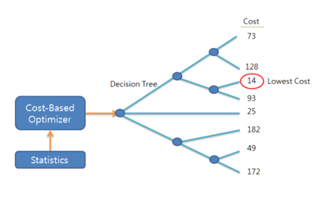
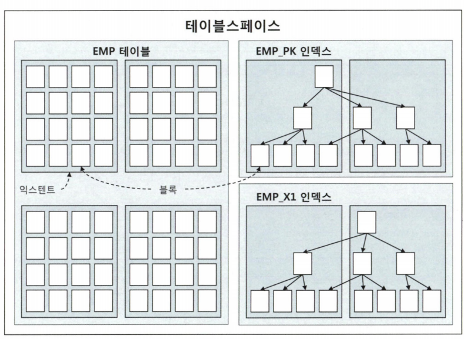

<!-- AUTO-GENERATED FROM NOTION. EDIT THE NOTION PAGE, NOT THIS FILE. -->

# SQL 튜닝

####  📌 SQL은 기본적으로 구조적이고 집합적이고 선언적인 질의 언어이다.

SQL 튜닝이란?

데이터베이스에서 실행되는 SQL 쿼리의 성능을 최적화하여, 최소한의 자원과 시간으로 원하는 결과를 빠르게 얻도록 개선하는 작업이다.

#### DBMS에는 ‘SQL 실행경로 미리보기’ 기능이 있다 (+ 비용 확인)

cmd에서 sqlplus를 통해서 진행할 것

**PLAN TABLE** : 실행계획을 확인하는 테이블

오라클 기준 sys.plan_table$ 테이블을 만들고,‘PLAN_TABLE’로 명명한 public synonym도 생성하므로
사용자가 별도로 PLAN TABLE을 만들 필요가 없다 (10g 버전 이후)

<details>
<summary>PLAN TABLE 생성 방법 및 확인 방법</summary>

```sql
@?/rdbms/admin/utlxplan.sql
# ? 는 $ORACLE_HOME 디렉토리를 대체하는 기호이다.
SELECT OWNER, SYNONYM_NAME, TABLE_OWNER, TABLE_NAME
FROM ALL_SYNONYMS
WHERE SYNONYM_NAME = 'PLAN_TABLE';
```

</details>

실행계획 확인은 explain plan 명령어를 수행하면 된다 그러면 SQL 실행계획이 plan_table에 저장된다.

<details>
<summary>더 많은 정보를 확인하는 방법</summary>

```sql
select * from table(dbms_xplan.display(null, null, 'advanced'));
# 3번째 인자에 다양한 옵션을 넣어 확인할 수 있다.
# serial, parallel, outline, alias, projection, all 등
```

</details>

미리보기 기능을 통해 자신이 작성한 SQL이 테이블을 스캔하는지 인덱스를 스캔하는지,
인덱스를 스캔한다면 어떤 인덱스인지를 확인할 수 있고, 
예상과 다른 방식으로 처리된다면 실행경로를 변경할 수 있다.

---

SQL*PLUS에서는** AutoTrace**를 활성화하고 SQL을 실행하면 실행계획을 확인할 수 있다

<details>
<summary>AutoTrace (데이터베이스 진단 도구)</summary>

SQL 문장을 실행할 때 그 결과와 함께 실행 계획과 성능 통계 정보를 자동으로 화면에 출력해준다

SET AUTOTRACE ON : SQL 실행 결과와 실행 계획, 통계 정보를 모두 출력한다.

SET AUTOTRACE TRACEONLY : 실제 SQL을 수행하되, 
화면에 데이터 결과는 보여주지 않고 실행 계획과 통계 정보만 출력한다.

SET AUTOTRACE ON EXPLAIN : 데이터 결과와 예상 실행 계획만 출력한다.

SET AUTOTRACE OFF : 기능을 끈다

</details>

```sql
# 테스트용 테이블 생성
CREATE TABLE T
AS SELECT d.no , e.*
from emp e, (select rownum no from dual connect by level <= 1000) d;

# 인덱스 생성
create index t_x01 on t(deptno,no);
create index t_x02 on t(deptno, job, no);

# T 테이블에 대한 통계정보를 수집
exec dbms_stats.gather_table_stats(user, 't');

# AutoTrace 활성화
set autotrace traceonly exp;

# 테스트 쿼리 실행
select * from t
where deptno = 10
and no = 1;
```


---

```sql
# 두번재 쿼리
Select /*+ index(t t_x02) */ * from t
where deptno = 10
and no = 1;
```


```sql
# 세번째 테스트 쿼리
Select /*+ full(t) */ * from T
where deptno = 10
and no = 1
```


3개의 결과에서 Cost 즉 비용의 값이 달라졌는데
옵티마이저는 이 비용을 근거로 T_X01 인덱스를 선택했다.

**비용은 쿼리를 수행하는 동안 발생할 것으로 예상하는 I/O 횟수 또는 예상 소요시간을 표현한 값이다.**

**SQL 실행계획에 표시되는 Cost는 어디까지나 예상치다.**

실측치가 아니므로 실제 수행할 때 발생하는 I/O 또는 시간과 많은 차이가 난다.

---

---

## SQL 파싱과 최적화

DBMS 내부에서 프로시저를 작성하고 컴파일해서 실행 가능한 상태로 만드는 전 과정을
**’SQL 최적화’**라고 부른다.

1단계 : SQL 파싱

사용자로부터 SQL을 전달받으면 가장 먼저 SQL 파서(Parser)가 파싱을 진행한다.
SQL 파싱을 요약하면 아래와 같다.

- **파싱 트리 생성** : SQL 문을 이루는 개별 구성 요소를 분석해서 파싱 트리 생성

- **Syntax 체크** : 문법적 오류가 없는지 확인.
  ex : 사용할 수 없는 키워드를 사용했거나 순서가 바르지 않거나 누락된 키워드 확인

- **Semantic 체크** : 의미상 오류가 없는지 확인
  ex : 존재하지 않는 테이블 또는 컬럼을 사용했는지, 사용한 OBJ에 대한 권한이 있는지 확인

---

2단계 : SQL 최적화

SQL 파싱 이후 최적화가 진행 → 옵티마이저가 그 역할을 맡는다.

SQL 옵티마이저는 미리 수집한 시스템 및 오브젝트 통계정보를 바탕으로 다양한 실제경로를
생성해서 비교한 후 가장 효율적인 하나를 선택한다.

데이터베이스 성능을 결정하는 가장 핵심적인 엔진이다.

---

3단계 : 로우 소스 생성

SQL 옵티마이저가 선택한 실행경로를 
실제 실행 가능한 코드 또는 프로시저 형태로 포맷팅 하는 단계.

로우 소스 생성기가 해당 역할을 맡는다.

## SQL 옵티마이저

**[ 옵티마이저 ]** : SQL문의 요구사항을 처리하기 위한 **최적의 실행 방법(실행계획)****을 결정**하는 역할

SQL은 결과를 선언하고, 옵티마이저는 그 결과를 만드는 절차를 결정한다.

사용자가 원하는 작업을 가장 효율적으로 수행할 수 있는 
최적의 데이터 액세스 경로를 선택해주는 DBMS의 핵심 엔진

> 💡 
> 
> ### 옵티마이저의 최적화 단계
> 
> 1. 사용자로부터 전달받은 쿼리를 수행하는 데 후보군이 될만한 
> 실행계획들을 찾아낸다.
> 
> 1. 데이터 딕셔너리에 미리 수집해 둔 오브젝트 통계 및 
> 시스템 통계정보를 이용해 각 실행계획의 예상비용을 산정한다.
> 
> 1. 최저 비용을 나타내는 실행계획을 선택한다.
> 
> 

#### 옵티마이저 힌트

SQL 옵티마이저는 좋은 선택을 하는건 맞지만 때로는 완벽하지 않다.
SQL이 복잡할수록 실수할 가능성도 크다.

통계 정보에 담을 수 없는 데이터 또는 업무 특성을 활용해 
개발자가 직접 더 효율적인 액세스 경로를 찾아낼 수도 있다.

이때 옵티마이저 힌트를 이용해 데이터 액세스 경로를 바꿀 수 있다.
힌트 사용법은 주석 기호에 ‘+’를 붙이면 된다.

```sql
SELECT /*+ INDEX(A 고객_PK) */
	고객명, 연락처, 주소, 가입일시
FROM 고객 A
WHERE 고객ID = '000000008'
```

---

주의사항

1. 힌트 안에 인자를 나열할 땐, 콤마( , )를 사용할 수 있지만, 
힌트와 힌트 사이에 사용하면 안된다.

```sql
/*+ INDEX(A A_X01) INDEX (B, B_X03) */ -> 모두 유효
/*+ INDEX(C), INDEX(D) */ -> 첫 번째 힌트만 유효 
```

1. 테이블을 지정할 때 스키마명까지 명시하면 안된다.

```sql
SELECT /*+ FULL(SCOTT.EMP) */
FROM EMP
```

1. FROM 절 테이블명 앞에 ALIAS를 지정했다면, 힌트에도 반드시 ALIAS를 사용해야 한다.

```sql
SELECT /*+ FULL(EMP) */ -> 무효
FROM EMP E
```

## SQL 공유 및 재사용

**라이브러리 캐시** : SQL 파싱, 최적화, 로우 소스 생성 과정을 거쳐 생성한 내부 프로시저를 반복 재사용할 수 있도록 캐싱해 두는 메모리 공간 → SGA(System Global Area) 구성요소

**SGA**는 서버 프로세스와 백그라운드 프로세스가 공통으로 액세스하는 
**데이터와 제어 구조를 캐싱하는 메모리 공간**이다.

사용자가 SQL을 전달 → DBMS가 파싱 → 라이브러리 캐시에 존재하는지 확인 →

라이브러리 캐시에 존재한다면

곧바로 실행 단계로 넘어간다

= **소프트 파싱 (Soft Parsing)**

---

라이브러리 캐시에 존재하지 않는다면

최적화 단계를 거친다.

= **하드 파싱 (Hard Parsing)**

#### SQL 파싱은 왜 하드한가?

네비게이션이 서울에서 부산까지의 이동 경로를 계산할 때 
한 번에 결과가 나오지 않고 약간의 소요시간이 걸리는 이유는 수많은 도로에서 가능성이 높은 주요 도로를 중심으로 후보군을 뽑고 그 중 가장 빠른 길을 선택하기 때문이다.

그만큼 엄청난 경우의 수를 보고 계산하는데

옵티마이저 또한 사용자가 생각하는 것보다 훨씬 더 많은 일을 수행한다.

옵티마이저가 연산을 하는 과정에서 사용하는 정보는 다음과 같다

- 테이블 , 컬럼 , 인덱스 구조에 관한 기본 정보

- 오브젝트 통계 : 테이블 통계 , 인덱스 통계 , (히스토그램을 포함한) 컬럼 통계

- 시스템 통계 : CPU 속도 , Single Block I/O 속도 , Multiblock I/O 속도 등

- 옵티마이저 관련 파라미터

하나의 쿼리를 수행하는 데 있어 후보군이 될만한 무수히 많은 실행경로를 도출하고,
짧은 순간에 딕셔너리와 통계정보를 읽어 각각에 대한 효율성을 판단하는 과정은 
결코 가벼울 수 없다.

데이터베이스에서 이루어지는 처리 과정은 대부분 I/O 작업에 집중되는 반면
하드 파싱은 CPU를 많이 소비하는 몇 안 되는 작업 중 하나이다.

### 이름 없는 SQL 문제

**사용자 정의 함수/프로시저, 트리거, 패키지 등은 생성할 때부터 이름을 갖는다.**

**컴파일한 상태로 딕셔너리에 저장되며, 사용자가 삭제하지 않는 이상 영구적으로 보관된다.**

**실행할 때 라이브러리 캐시에 적재함으로써 여러 사용자가 공유하면서 재사용한다.**

하지만, SQL은 이름이 따로 없다. 
**전체 SQL 텍스트가 이름 역할**을 한다.

딕셔너리에 저장되지 않는다.

처음 실행할 때 최적화 과정을 거쳐 동적으로 생성한 내부 프로시저를
라이브러리 캐시에 적재함으로써 여러 사용자가 공유하면서 재사용한다.

캐시 공간이 부족해지면 버려졌다가 다음에 다시 실행할 때 똑같은 최적화 과정을 거쳐
캐시에 적재된다.

<details>
<summary>그럼 사용자 정의 함수/프로시저 처럼 영구 저장할 수 없을까?</summary>

> 대부분의 DBMS는 이를 지원하지 않는다.

사용자 정의 함수/프로시저는 내용을 수정해도 이름이 바뀌지 않는다 

→ 같은 프로그램을 무한 생성하지 않는다.

#### 그러나,

**SQL은 이름이 없고, SQL 자체가 이름이기 때문에 텍스트의 작은 부분이라도 수정한다.**

**→ 다른 객체가 새로 탄생하는 구조**

DBMS에서 수행되는 **SQL이 모두 완성된 SQL은 아니며,**
특히 개발 과정에는 수시로 변경이 일어나고, 일회성(ad hoc) SQL도 많다.

일회성 또는 무효화된 SQL까지 모두 저장하려면 **많은 공간이 필요**하고 그만큼 **SQL을 찾는 속도가 느려진다.**

→ 이런 이유로 대부분의 DBMS가 SQL을 영구 저장하지 않는 쪽을 택한 이유이다.

</details>

---

### 공유 가능 SQL

라이브러리 캐시에서 SQL을 찾기 위해 사용하는 키 값이 ‘SQL 문 그 자체’이다.

의미가 같은 SQL 문장을 여러개 작성했다고 하더라도 , 그 SQL들은 모두 다른 SQL이다.

의미적으로는 같지만, 실행할 때 각각 최적화를 진행하고 
라이브러리 캐시에서 별도 공간을 사용한다.

> ⭐ 
> 
> ## 데이터 저장 구조 및 I/O 메커니즘
> 
> I/O ,  즉 컴퓨터의 입출력 (Input / Output)의 튜닝은 곧 SQL 튜닝이라고 해도 과언이 아니다.
> 
> = SQL 튜닝을 이해하려면 I/O에 대한 이해가 중요하다
> 
> SQL이 느린 이유도 디스크 I/O 때문에 일어나는 현상이다.
> 
> OS 또는 I/O 서브시스템이 I/O를 처리하는 동안 프로세스는 잠을 잔다.
> 
> 이유는 여러 가지가 있지만, I/O가 가장 대표적이고 절대 비중을 차지한다.
> 
> **프로세스 (Process)는 ‘실행 중인 프로그램’** 이며,
> 
> **생명주기****를 갖는다**.
> 
> 
> 
> 생성 (new) 이후 종료 (terminated) 전까지 
> 준비 (ready)와 실행 (running)과 대기 (waiting) 상태를 **반복**한다.
> 
> 실행 중인 프로세스는 interrupt 에 의해 수시로 실행 준비 상태 (Running Queue)로,
> 전환했다가 다시 실행 상태로 전환한다.
> 
> 여러 프로세스가 하나의 CPU를 공유할 수 있지만,
> **특정 순간**에는 하나의 프로세스만 CPU를 사용할 수 있기 때문에 
> 이런 메커니즘이 필요하다.
> 
> interrupt 없이 일하던 프로세스도 디스크에서 데이터를 읽어야 할 때는
> CPU를 OS에 반환하고 잠시 waiting 상태에서 I/O가 완료되기를 기다린다. 
> 
> 정해진 OS 함수를 호출 (= I/O call) 하고 CPU를 반환한 채 알람을 설정하고
> 대기 큐 (wait Queue)에서 잠을 자는 것이다.
> 
> I/O Call 속도는 Single Block I/O 기준으로 평균 10ms 쯤 된다.
> 
> 초당 100블록 쯤 읽는 셈이다
> 
> <details>
> <summary>블록이란?</summary>
> 
> 하드디스크나 SSD 같은 저장 장치에서 데이터를 읽고 쓰는 **가장 기본적인
> 최소 단위(덩어리)**를 뜻한다.
> 
> 디스크에서 글자 한 개, 1바이트씩만 가져오는 것은 매우 비효율적이다.
> 따라서 책 한 권을 상자에 담아 옮기듯,
> 
> 보통 **4KB 등의 일정한 크기로 묶은 데이터 뭉치를 한 블록이라고 한다**.
> 
> </details>
> 
> 시대가 지나면서 스토리지 성능은 빨라지고 있지만, SQL에서는 기대에 미치지 못한다.
> 
> 어떤 SQL이 Single Block I/O 방식으로 10,000 블록을 읽는다면,
> 가장 최신 스토리지에서도 10초 이상 기다려야 한다.
> 
> 전반적으로 I/O 튜닝이 안 된 시스템이라면, 수많은 프로세스에 의해 동시다발적으로 발생하는 I/O Call 때문에 디스크 경합이 심해지고 그만큼 대기 시간도 늘어난다.
> 
>  = 일 처리를 효율적으로 분산하거나 묶어서 처리하는 규칙(I/O 튜닝)이 없어서, 하나의 디스크에 병목 현상이 생겨 컴퓨터 전체가 느려진다
> 
> <details>
> <summary>비유적 표현</summary>
> 
> 주방 시스템(I/O 튜닝)이 엉망인 음식점에서는, 수많은 배달 기사(프로세스)들이 동시에 음식 달라고 요청(I/O Call)하는 바람에, 
> 주방 요리사 한 명(디스크)에게 주문이 꽉 막혀버려(경합 심화) 
> 기사님들이 가게 밖에서 멍하니 기다리는 시간(대기 시간)만 
> 하염없이 길어진다.
> 
> </details>
> 
> SQL이 느린 이유가 바로 디스크 I/O 때문인 것이다
> 
> ### 데이터베이스 저장 구조
> 
> I/O 메커니즘을 자세히 설명하기 위해서는 
> 먼저 데이터베이스 저장 구조를 알아보아야 한다.
> 
> 데이터를 저장하려면 먼저 **테이블스페이스를 생성**해야 한다.
> 
> **테이블스페이스**는 세그먼트를 담는 콘테이너로서,
> 여러 개의 데이터파일(디스크 상의 물리적인 OS 파일)로 구성된다.
> 
> 
> 
> 테이블스페이스를 생성했다면 이후 **세크먼트를 생성**한다.
> 
> 세그먼트는 테이블, 인덱스처럼 저장공간이 필요한 오브젝트이다.
> 
> <details>
> <summary>비유적 표현</summary>
> 
> 테이블스페이스가 하나의 아파트 단지라면,
> 세그먼트는 단지 내에 세워진 개별 아파트 건물과 같다.
> 
> </details>
> 
> 테이블, 인덱스를 생성할 때 데이터를 어떤 테이블스페이스에 저장할지를 지정한다.
> 
> <details>
> <summary>또 **세그먼트는 여러 익스텐트로 구성**된다.</summary>
> 
> 익스텐트는 공간을 확장하는 단위이다.
> 
> 테이블이나 인덱스에 데이터를 입력하다가 공간이 부족해진다면
> 해당 오브젝트가 속한 테이블스페이스로부터 익스텐트를 추가로
> 할당받는다.
> 
> 익스텐트는 연속된 블록들의 집합이기도 하다.
> 
> </details>
> 
> <details>
> <summary>파티션 구조가 아니라면 **테이블도 하나의 세그먼트**이고,
> **인덱스도 하나의 세그먼트**이다. </summary>
> 
> 파티션을 나누지 않은 **일반적인 테이블은 그 자체가 하나의 독립된 건물
> 즉 세그먼트이다.**
> 
> 인덱스는 책의 부록이나 안내데스크 같은 별도의 존재이므로,
> 테이블 건물 옆에 인덱스 전용 건물(세그먼트)를 따로 만들어낸다.
> 
> 둘은 주소만 공유할 뿐, 완전히 다른 세그먼트이다.
> 
> </details>
> 
> <details>
> <summary>테이블 또는 인덱스가 파티션 구조라면, **각 파티션이 하나의 세그먼트가 된다**.</summary>
> 
> **데이터가 너무 많아서 테이블을 특정 기준으로 쪼개는 것을 
> 파티션**이라고 한다.
> 
> EX.) 매출 테이블을 년도별로 쪼갠다고 가정하면
> 
> 2024년, 2025년, 2026년 등으로 쪼갤 수 있다
> 
> 이때 매출 테이블이라는 이름은 하나지만, 
> 실제로는 각 년도별로 독립된 건물(세그먼트)가 생성된다.
> 
> </details>
> 
> <details>
> <summary>**LOB 컬럼은 그 자체가 하나의 세그먼트를 구성**하므로 **자신이 속한 테이블과 다른 별도 공간에 값을 저장**한다.</summary>
> 
> LOB = Large Object의 경우 데이터 파일의 크기가 크기 때문에
> 테이블에 들어오게 된다면 다른 파일들을 보관할 수가 없다.
> 
> 때문에 이를 보관할 수 있는 전용 세그먼트,
> LOB 세그먼트를 따로 만들어 보관하게 된다.
> 
> </details>
> 
> 세그먼트는 익스텐트 단위로 확장되지만,
> 사용자가 입력한 레코드를 실제로 저장하는 공간은 데이터 블록이다.
> 
> 특정 DBMS들은 블록 대신 페이지(page) 라는 용어를 사용한다.
> 
> **한 블록은 하나의 테이블이 독점**한다.
> 즉, 한 블록에 저장된 레코드는 모두 같은 테이블 레코드이다.
> 
> **한 익스텐트도 하나의 테이블이 독점**한다.
> 
> 즉 한 익스텐트에 담긴 블록은 모두 같은 테이블 블록이다.
> 
> ---
> 
> > ⭐ **테이블스페이스 구조 요약**
> > 
> > **블록** : 데이터를 읽고 쓰는 단위
> > 
> > **테이블스페이스** : 여러 세그먼트가 공간을 할당받는 논리적 저장 영역
> > 
> > **세그먼트** : 특정 객체나 용도를 위한 저장 공간 (오브젝트)
> > 
> > 하나 이상의 익스텐트로 구성된다.
> > 
> > **익스텐트** :  공간을 확장하는 단위 , 연속된 데이터 블록들의 집합
> > 
> > 세그먼트에 할당된 익스텐트와 그 내부 블록들은 할당이 유지되는 동안 
> > 해당 세그먼트에서 사용된다.
> > 
> > 세그먼트가 추가 공간을 필요로 하면 새로운 익스텐트를 할당 받을 수 있다.
> 
> ---
> 
> 세그먼트 공간이 부족해지면 테이블스페이스로부터 익스텐트를 추가로 할당 받는다고 하였지만, **세그먼트에 할당된 모든 익스텐트가 같은 데이터파일에 위치하지 않을 가능성이 높다.**
> 
> **하나의 테이블스페이스를 여러 데이터파일로 구성하면, ****파일 경합****을 줄이기 위해 DBMS가 데이터를 가능한 한 여러 데이터파일로 분산해서 저장하기 때문**이다.
> 
> #### 파일 경합이란
> 
> 여러 사용자가 동시에 하나의 특정 테이블을 조회하거나 데이터를 넣을 때,
> 컴퓨터는 그 하나의 데이터파일에만 모든 I/O 요청을 집중시킨다.
> 
> 그러면 요청 줄이 길게 늘어지기 때문에 성능 면에서 엄청나게 느려진다.
> 
> 때문에 익스텐트를 여러 데이터 파일에 쪼개서 넣게된다면
> 대량의 데이터를 조회할 때 병렬 처리가 가능하기 때문에 
> I/O 분산이 일어나며 성능이 획기적으로 빨라진다.
> 
> 
> 
> **익스텐트 내 블록은 서로 인접한 연속된 공간이지만,
> 익스텐트끼리는 연속된 공간이 아니다.**
> 
> <details>
> <summary>오라클에서 세크먼트에 할당된 익스텐트 목록을 조회하는 방법</summary>
> 
> ```sql
> SELECT segment_type, tablespace_name, extent_id, file_id, block_id, blocks
> FROM dba_extents
> WHERE owner = USER
> and segment_name = 'MY_SEGMENT'
> ORDER BY extent_id;
> ```
> 
> </details>
> 
> <details>
> <summary>**DBA (Data Block Address)**</summary>
> 
> **모든 데이터 블록은 디스크 상에서 몇 번 데이터파일의 몇 번째 블록인지를 
> 나타내는 자신만의 고유 주소값을 갖는다.**
> 
> 이 주소값을 DBA 라고 부른다.
> 
> 데이터를 읽고 쓰는 단위가 블록이므로 **데이터를 읽으려면 먼저 DBA부터
> 확인해야 한다.**
> 
> 인덱스를 이용해 테이블 레코드를 읽을 때는 인덱스 ROWID를 사용한다.
> **ROWID는 DBA + 로우 번호(블록 내 순번)로 구성**되므로 이를 분해하면
> 읽어야 할 테이블 레코드가 저장된 DBA를 알 수 있다.
> 
> **테이블을 스캔할 때는 테이블 세크먼트 헤더에 저장된 익스텐트 맵을 이용**한다.
> 
> **익스텐트 맵을 통해 각 인스텐트의 첫 번째 블록 DBA를 알 수 있다.**
> 익스텐트는 연속된 블록 집합이므로 **테이블을 스캔할 때는 첫 번째 블록 뒤에
> 연속해서 저장된 블록을 읽으면 된다.**
> 
> </details>
> 
> ---
> 
> > ⭐ **테이블스페이스 최종 요약**
> > 
> > **개념적으로 보았을 때** 테이블스페이스 안에는
> > 
> > 여러 세그먼트가 있고 각 세그먼트에는
> > 
> > 여러 익스텐트가 있으며 각 익스텐트 안에는
> > 
> > 여러 데이터 블록이 있다
> > 
> > 익스텐트는 할당받은 세그먼트가 독점하며
> > 데이터 블록 또한 할당받은 세그먼트가 독점한다
> > 
> > ---
> > 
> > **물리적으로 보았을 때** 테이블스페이스 안에는
> > 
> > 여러 데이터 파일들이 존재하며
> > 
> > 각 데이터 파일 안에는 여러 익스텐트가 존재한다
> > 
> > 각 익스텐트는 여러 데이터 블록을 가지고 있다
> > 
> > 하지만 각각의 익스텐트는 
> > 하나의 세그먼트에서 온 익스텐트가 아닌
> > 
> > 여러 세그먼트에서 온 익스텐트일 가능성이 높으며 
> > 이는 파일 경합을 막기 위해 
> > 각각의 데이터 파일에 쪼개져서 저장된다.
> 
> 
> 
> ### 블록 단위 I/O
> 
> 클라우드에 위치한 문서는 파일 단위로 저장하고, 파일 단위로 읽는다.
> 
> 데이터 I/O 단위는 블록이므로 특정 레코드 하나를 읽고 싶어도 
> 해당 블록을 통째로 읽는다.
> 
> 1Byte짜리 컬럼 하나만 읽고 싶어도 블록을 통째로 읽는다.
> 
> 오라클은 기본적으로 8KB 크기의 블록을 사용하므로
> 1Byte를 읽기 위해 8KB를 읽는 셈이다
> 
> ```sql
> SHOW parameter block_size
> ```
> 
> ```sql
> SELECT value From v$parameter WHERE name = 'db_block_size';
> ```
> 
> 테이블 뿐만 아니라 인덱스도 블록 단위로 데이터를 읽고 쓴다.
> 
> 
> 
> ### 시퀀셜 액세스 vs. 랜덤 액세스
> 
> 테이블 또는 인덱스 블록을 액세스하는(= 읽는) 방식으로는 
> **시퀀셜 액세스와 랜덤 액세스**, 두 가지가 있다.
> 
> **시퀀셜(Sequential) 액세스**
> 
> **논리적 또는 물리적으로 연결된 순서에 따라 차례대로 블록을 읽는 방식**
> 
> 인덱스 리프 블록(최하단 노드)는 **앞뒤를 가리키는 주소값을 통해 논리적으로 
> 서로 연결**돼 있다.
> 
> 이 주소 값에 따라 **앞 또는 뒤로 순차적으로 스캔하는 방식이 시퀀셜 액세스**이다.
> 
> 
> 
> 블록들은 독립적으로 떨어져있는 것처럼 보이지만,
> 내부적으로는 이웃한 블록의 주소값을 가지고 있다.
> 
> 때문에 리프 노드에 그어진 화살표처럼 순차적으로 스캔한다.
> 
> ---
> 
> 테이블의 경우 테이블 블록 간에는 서로 논리적인 연결고리를 가지고 있지 않다.
> 
> 오라클은 세그먼트에 할당된 익스텐트 목록을 세그먼트 헤더에 맵으로 관리한다.
> 
> 익스텐트 맵(Map)은 각 익스텐트의 첫 번째 블록 주소 값을 갖는다.
> 
> 읽어야 할 익스텐트 목록을 익스텐트 맵에서 얻고,
> 각 익스텐트의 첫 번째 블록 뒤에 연속해서 저장된 블록 순서를 읽으면,
> 그것이 곧 Full Table Scan 이다.
> 
> <details>
> <summary>심화</summary>
> 
> 익스텐트 맵은 첫 번재 익스텐트의 첫 번째 블록에 저장되어 있다.
> 
> Full Table Scan을 진행하면
> 
> 익스텐트 맵에 몇 번 익스텐트까지 읽어야 하는지 주소를 확인하고
> 테이블의 첫 번째 익스텐트의 첫 번째 블록부터 스캔을 시작하며
> 데이터가 들어있는 마지막 익스텐트까지 전부 스캔을 진행하고 멈춘다.
> 
> 이때 마지막 데이터 이후 빈 블록들이라면 그 데이터까지 진행하고 멈추게되는데, 이는 HWM의 기능이며
> 
> HWM은 High Water Mark의 약자이며,
> 익스텐트 맵을 가지고 있는 첫 번째 익스텐트의 첫 번째 블록 안에 
> HWM 저장 공간이 별도로 있다
> 
> HWM은 테이블에 데이터가 한창 가장 많이 채워졌을 때 도달했던 경계선이며, 쉽게 말해 테이블에 데이터가 어디까지 들어간 적이 있었는지를 
> 보여주는 최대 높이 눈금이라고 보면 된다.
> 
> 데이터를 INSERT 할 수록 HWM은 넣은만큼 증가하며
> 데이터를 DELETE 하여도 HWM은 감소하지 않는다
> 
> 때문에 오라클은 스캔하기 전 HWM 주소를 확인하고
> 해당 테이블은 몇 번째 블록까지 데이터가 저장되었는지 확인하고
> 해당 블록까지 스캔하고 해당 블록 뒤에 빈 블록이 아무리 많아도 스캔을
> 중단한다.
> 
> </details>
> 
> ---
> 
> **랜덤(Random) 액세스**
> 
> 논리적, 물리적 순서를 따르지 않고,
> 레코드 하나를 읽기 위해 한 블록씩 접근(= touch)하는 방식이다.
> 
> 
